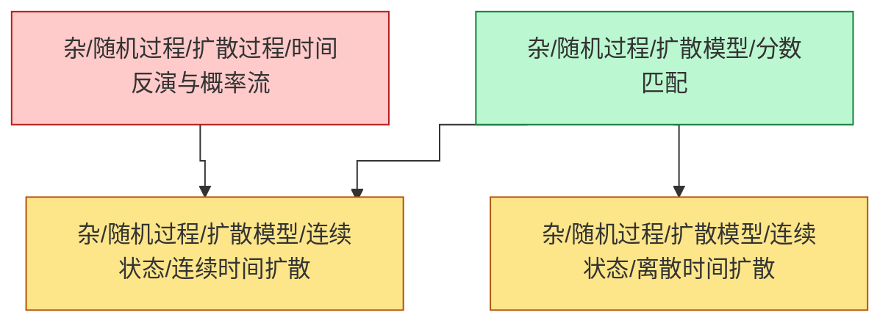

```mermaid
%%{init: {'flowchart': {'curve': 'stepAfter'}}}%%
graph TD
1["杂/随机过程/扩散模型/分数匹配"] --> 0["杂/随机过程/扩散模型/连续状态/连续时间扩散"]
2["杂/随机过程/扩散过程/时间反演与概率流"] --> 0["杂/随机过程/扩散模型/连续状态/连续时间扩散"]
1["杂/随机过程/扩散模型/分数匹配"] --> 3["杂/随机过程/扩散模型/连续状态/离散时间扩散"]
classDef leaf fill:#fde68a,stroke:#b45309
class 0,3 leaf
classDef externalRoot fill:#fecaca,stroke:#b91c1c
class 2 externalRoot
classDef foundationRoot fill:#bbf7d0,stroke:#15803d
class 1 foundationRoot
click 0 "/杂/随机过程/扩散模型/连续状态/连续时间扩散" "杂/随机过程/扩散模型/连续状态/连续时间扩散"
click 1 "/杂/随机过程/扩散模型/分数匹配" "杂/随机过程/扩散模型/分数匹配"
click 2 "/杂/随机过程/扩散过程/时间反演与概率流" "杂/随机过程/扩散过程/时间反演与概率流"
click 3 "/杂/随机过程/扩散模型/连续状态/离散时间扩散" "杂/随机过程/扩散模型/连续状态/离散时间扩散"
```