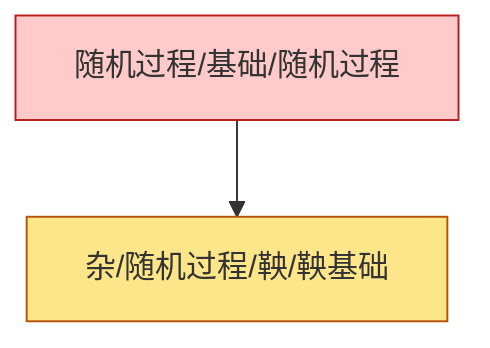

```mermaid
%%{init: {'flowchart': {'curve': 'stepAfter'}}}%%
graph TD
1["随机过程/基础/随机过程"] --> 0["杂/随机过程/鞅/鞅基础"]
classDef leaf fill:#fde68a,stroke:#b45309
class 0 leaf
classDef externalRoot fill:#fecaca,stroke:#b91c1c
class 1 externalRoot
click 0 "/杂/随机过程/鞅/鞅基础" "杂/随机过程/鞅/鞅基础"
click 1 "/随机过程/基础/随机过程" "随机过程/基础/随机过程"
```