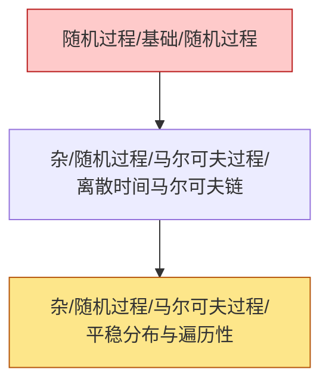

```mermaid
graph TD
1["随机过程/基础/随机过程"] --> 0["杂/随机过程/马尔可夫过程/离散时间马尔可夫链"]
0["杂/随机过程/马尔可夫过程/离散时间马尔可夫链"] --> 2["杂/随机过程/马尔可夫过程/平稳分布与遍历性"]
classDef leaf fill:#fde68a,stroke:#b45309
class 2 leaf
classDef externalRoot fill:#fecaca,stroke:#b91c1c
class 1 externalRoot
click 0 "/杂/随机过程/马尔可夫过程/离散时间马尔可夫链" "杂/随机过程/马尔可夫过程/离散时间马尔可夫链"
click 1 "/随机过程/基础/随机过程" "随机过程/基础/随机过程"
click 2 "/杂/随机过程/马尔可夫过程/平稳分布与遍历性" "杂/随机过程/马尔可夫过程/平稳分布与遍历性"
```