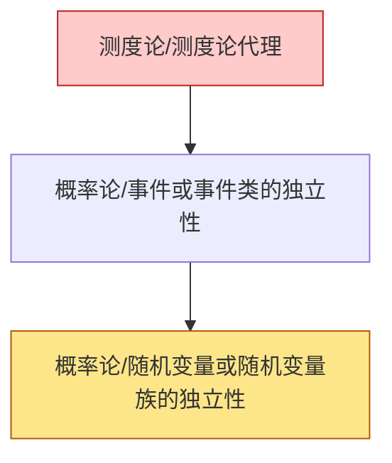

```mermaid
graph TD
1["测度论/测度论代理"] --> 0["概率论/事件或事件类的独立性"]
0["概率论/事件或事件类的独立性"] --> 2["概率论/随机变量或随机变量族的独立性"]
classDef leaf fill:#fde68a,stroke:#b45309
class 2 leaf
classDef externalRoot fill:#fecaca,stroke:#b91c1c
class 1 externalRoot
```