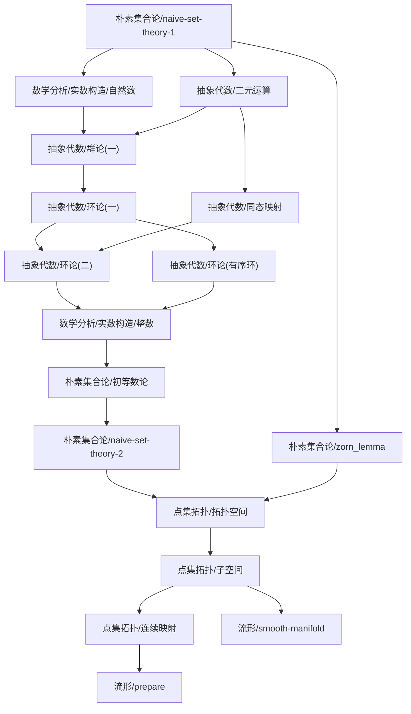

```mermaid
graph TD
1["点集拓扑/连续映射"] --> 0["流形/prepare"]
3["点集拓扑/子空间"] --> 2["流形/smooth-manifold"]
5["点集拓扑/拓扑空间"] --> 3["点集拓扑/子空间"]
6["朴素集合论/naive-set-theory-2"] --> 5["点集拓扑/拓扑空间"]
7["朴素集合论/zorn_lemma"] --> 5["点集拓扑/拓扑空间"]
8["朴素集合论/初等数论"] --> 6["朴素集合论/naive-set-theory-2"]
9["朴素集合论/naive-set-theory-1"] --> 7["朴素集合论/zorn_lemma"]
10["数学分析/实数构造/整数"] --> 8["朴素集合论/初等数论"]
11["抽象代数/环论(二)"] --> 10["数学分析/实数构造/整数"]
12["抽象代数/环论(有序环)"] --> 10["数学分析/实数构造/整数"]
13["抽象代数/环论(一)"] --> 11["抽象代数/环论(二)"]
14["抽象代数/同态映射"] --> 11["抽象代数/环论(二)"]
13["抽象代数/环论(一)"] --> 12["抽象代数/环论(有序环)"]
15["抽象代数/群论(一)"] --> 13["抽象代数/环论(一)"]
16["数学分析/实数构造/自然数"] --> 15["抽象代数/群论(一)"]
17["抽象代数/二元运算"] --> 15["抽象代数/群论(一)"]
9["朴素集合论/naive-set-theory-1"] --> 16["数学分析/实数构造/自然数"]
9["朴素集合论/naive-set-theory-1"] --> 17["抽象代数/二元运算"]
17["抽象代数/二元运算"] --> 14["抽象代数/同态映射"]
3["点集拓扑/子空间"] --> 1["点集拓扑/连续映射"]
```
