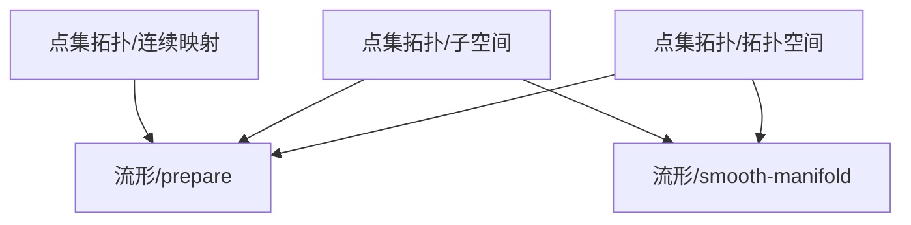

```mermaid
graph TD
1["点集拓扑/拓扑空间"] --> 0["流形/prepare"]
2["点集拓扑/子空间"] --> 0["流形/prepare"]
3["点集拓扑/连续映射"] --> 0["流形/prepare"]
1["点集拓扑/拓扑空间"] --> 4["流形/smooth-manifold"]
2["点集拓扑/子空间"] --> 4["流形/smooth-manifold"]
```