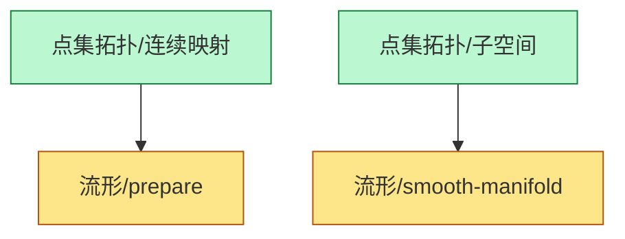

```mermaid
graph TD
1["点集拓扑/连续映射"] --> 0["流形/prepare"]
3["点集拓扑/子空间"] --> 2["流形/smooth-manifold"]
classDef leaf fill:#fde68a,stroke:#b45309
class 0,2 leaf
classDef foundationRoot fill:#bbf7d0,stroke:#15803d
class 1,3 foundationRoot
```