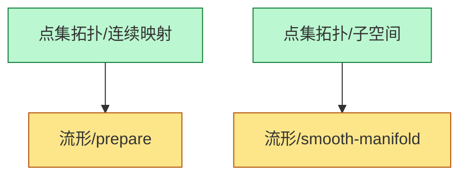

```mermaid
graph TD
1["点集拓扑/连续映射"] --> 0["流形/prepare"]
3["点集拓扑/子空间"] --> 2["流形/smooth-manifold"]
classDef leaf fill:#fde68a,stroke:#b45309
class 0,2 leaf
classDef foundationRoot fill:#bbf7d0,stroke:#15803d
class 1,3 foundationRoot
click 0 "/流形/prepare" "流形/prepare"
click 1 "/点集拓扑/连续映射" "点集拓扑/连续映射"
click 2 "/流形/smooth-manifold" "流形/smooth-manifold"
click 3 "/点集拓扑/子空间" "点集拓扑/子空间"
```