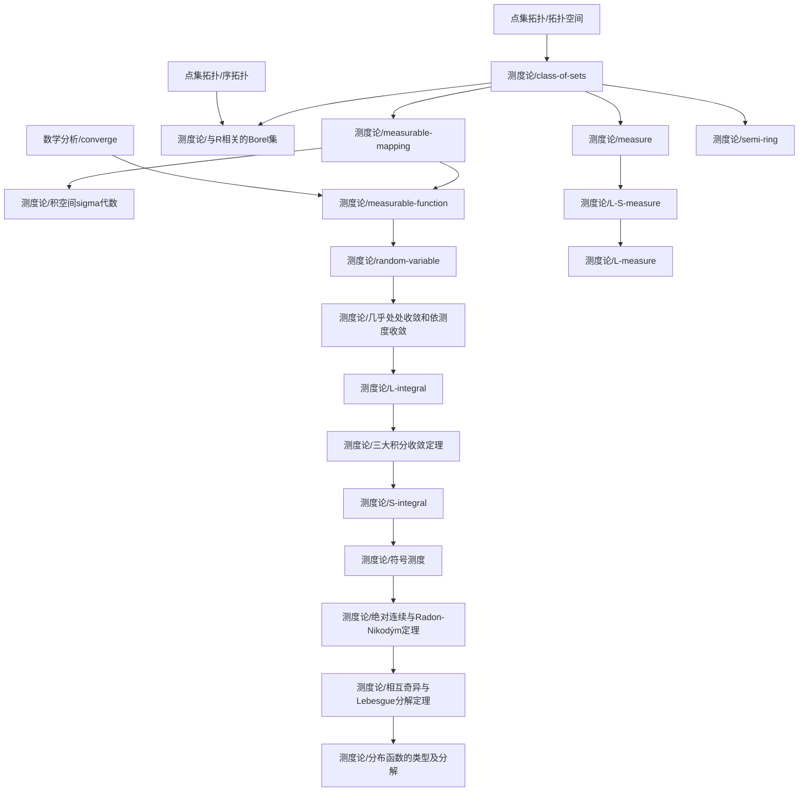

```mermaid
graph TD
1["点集拓扑/拓扑空间"] --> 0["测度论/class-of-sets"]
3["测度论/S-integral"] --> 2["测度论/符号测度"]
5["测度论/measurable-mapping"] --> 4["测度论/积空间sigma代数"]
0["测度论/class-of-sets"] --> 5["测度论/measurable-mapping"]
0["测度论/class-of-sets"] --> 6["测度论/与R相关的Borel集"]
7["点集拓扑/序拓扑"] --> 6["测度论/与R相关的Borel集"]
5["测度论/measurable-mapping"] --> 8["测度论/measurable-function"]
9["数学分析/converge"] --> 8["测度论/measurable-function"]
8["测度论/measurable-function"] --> 10["测度论/random-variable"]
12["测度论/measure"] --> 11["测度论/L-S-measure"]
0["测度论/class-of-sets"] --> 13["测度论/semi-ring"]
15["测度论/L-integral"] --> 14["测度论/三大积分收敛定理"]
2["测度论/符号测度"] --> 17["测度论/绝对连续与Radon-Nikodým定理"]
0["测度论/class-of-sets"] --> 12["测度论/measure"]
10["测度论/random-variable"] --> 18["测度论/几乎处处收敛和依测度收敛"]
11["测度论/L-S-measure"] --> 19["测度论/L-measure"]
14["测度论/三大积分收敛定理"] --> 3["测度论/S-integral"]
17["测度论/绝对连续与Radon-Nikodým定理"] --> 20["测度论/相互奇异与Lebesgue分解定理"]
18["测度论/几乎处处收敛和依测度收敛"] --> 15["测度论/L-integral"]
20["测度论/相互奇异与Lebesgue分解定理"] --> 21["测度论/分布函数的类型及分解"]
```