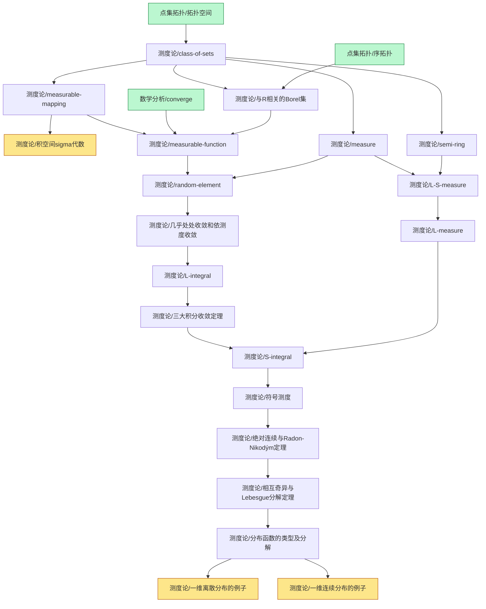

```mermaid
graph TD
1["测度论/分布函数的类型及分解"] --> 0["测度论/一维离散分布的例子"]
3["点集拓扑/拓扑空间"] --> 2["测度论/class-of-sets"]
5["测度论/S-integral"] --> 4["测度论/符号测度"]
7["测度论/measurable-mapping"] --> 6["测度论/积空间sigma代数"]
1["测度论/分布函数的类型及分解"] --> 8["测度论/一维连续分布的例子"]
2["测度论/class-of-sets"] --> 7["测度论/measurable-mapping"]
2["测度论/class-of-sets"] --> 9["测度论/与R相关的Borel集"]
10["点集拓扑/序拓扑"] --> 9["测度论/与R相关的Borel集"]
7["测度论/measurable-mapping"] --> 11["测度论/measurable-function"]
12["数学分析/converge"] --> 11["测度论/measurable-function"]
9["测度论/与R相关的Borel集"] --> 11["测度论/measurable-function"]
14["测度论/measure"] --> 13["测度论/L-S-measure"]
15["测度论/semi-ring"] --> 13["测度论/L-S-measure"]
11["测度论/measurable-function"] --> 16["测度论/random-element"]
14["测度论/measure"] --> 16["测度论/random-element"]
2["测度论/class-of-sets"] --> 15["测度论/semi-ring"]
18["测度论/L-integral"] --> 17["测度论/三大积分收敛定理"]
4["测度论/符号测度"] --> 19["测度论/绝对连续与Radon-Nikodým定理"]
2["测度论/class-of-sets"] --> 14["测度论/measure"]
16["测度论/random-element"] --> 20["测度论/几乎处处收敛和依测度收敛"]
13["测度论/L-S-measure"] --> 21["测度论/L-measure"]
17["测度论/三大积分收敛定理"] --> 5["测度论/S-integral"]
21["测度论/L-measure"] --> 5["测度论/S-integral"]
19["测度论/绝对连续与Radon-Nikodým定理"] --> 22["测度论/相互奇异与Lebesgue分解定理"]
20["测度论/几乎处处收敛和依测度收敛"] --> 18["测度论/L-integral"]
22["测度论/相互奇异与Lebesgue分解定理"] --> 1["测度论/分布函数的类型及分解"]
classDef leaf fill:#fde68a,stroke:#b45309
class 0,6,8 leaf
classDef foundationRoot fill:#bbf7d0,stroke:#15803d
class 3,10,12 foundationRoot
```