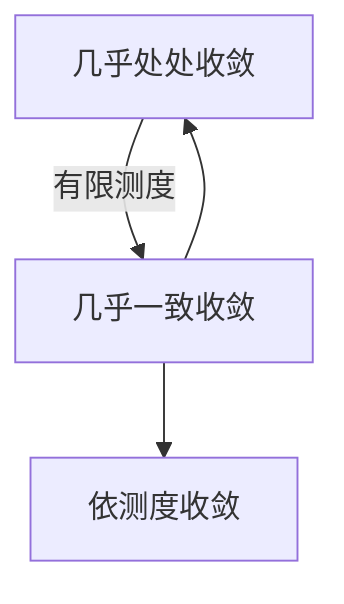

测度论中的a.e.(**almost everywhere**) 就是概率论里的a.s.(**almost surely**)

依概率收敛是依测度收敛在概率论中的表现形式。

在本节的所有定义和性质中，大部分都可以 将函数的陪域替换为更一般的可测空间、拓扑空间或度量空间。
可替换的部分将依次在开头使用【可】、【拓】、【度】来标记。

## 前置

[[测度论与概率论/measurable-func]]

## 关系图

## 定义

- 设$f,g$均为定义在测度空间$(\Omega,\mathcal{F},\mu)$上的广义实值函数
  - 若$\mu(f\not=\pm\infty)=0$,则称$f$**几乎处处有限**(finite almost everywhere)(a.e. 有限)
  - 【度】若$\exists M>0$ s.t. $\mu(|f| > M)=0$, 则称$f$**几乎处处有界**(bounded almost everywhere)(a.e. 有界)
  - 【可】若$\mu(f\not=g)=0$,则称$f$与$g$**几乎处处相等**(equal almost everywhere)($f=g$ a.e.)
  - 若$\mu(f < g)=0$, 则称$f$**几乎处处大于**($f \geq g$ a.e.)
  - 【可】若$\exists g \in \overline{\mathcal{L}}(\Omega,\mathcal{F})$ s.t. $f=g$ a.e.,则称$f$**几乎处处可测**(measurable almost everywhere)(a.e. 可测)
- 【可】设$\{f,f_n, n\geq1\}$是a.e.有限的广义实值函数列，若存在零测集$N$使得$\omega \in N^c$时,$f_n(\omega) \to f(\omega)$，则称$f_n$**几乎处处收敛**(almost everywhere convergence)(a.e. 收敛)到$f$。记作$f_n \overset{\text{a.e.}}{\to} f$。
- 【度】设$\{f,f_n, n\geq 1\}$是a.e.有限的广义实值函数列，若存在零测集$N$使得$\omega \in N^c$时，$\{f_n,n\geq 1\}$为基本列，则称$\{f_n\}$为**几乎处处收敛的基本列**
- 【度】设$f,f_n, n\geq 1$为广义实值可测函数列，若$\forall \delta>0$,存在满足$\mu(A)<\delta$的$A\in \mathcal{F}$使得$\{f_n\}$在$A^c$上一致收敛于$f$,则称$\{f_n\}$**几乎一致收敛**于$f$。记作$f_n \overset{\text{a.un.}}{\to} f$。
- 【度】设$\{f,f_n, n\geq 1\}$是a.e.有限的广义实值可测函数列，若$\lim\limits_{n\to\infty}\mu\{|f_n -f|\geq \epsilon\}=0,\forall \epsilon>0$，则称$\{f_n\}$**依测度收敛**于$f$。记作$f_n \overset{\mu}{\to} f$。
- 【度】设$\{f_n, n\geq 1\}$是a.e.有限的广义实值可测函数列，若$\lim\limits_{m,n\to\infty}\mu\{|f_m -f_n|\geq \epsilon\}=0,\forall \epsilon>0$，则称$\{f_n\}$为**依测度收敛的基本列**。
- 设$\{\mathbf{X},\mathbf{X}_n, n\geq 1\}$为$d$维R.V.序列，若$\lim\limits_{n\to\infty}P\{|\mathbf{X}_n - \mathbf{X}|\geq \epsilon\}=0,\forall \epsilon>0$，则称$\{\mathbf{X}_n\}$为**依概率收敛**于$\mathbf{X}$。记作$\mathbf{X}_n \overset{\text{P}}{\to} \mathbf{X}$。

## 性质

1. 【可】若$\mu$是$\mathcal{F}$上的完备测度，则
   - 几乎处处相等的函数要么都可测，要么都不可测。
   - 几乎处处可测函数是可测函数。
2. 设$\{f_n, n\geq 1\} \subseteq \overline{\mathcal{L}}(\Omega,\mathcal{F})$，$f$为广义实值函数，$f_n \overset{a.e.}{\to} f$，则$f$ a.e.可测，进一步地若$\mu$为完备测度，那么$f$可测。
3. 【度】设$\{f,f_n, n\geq 1\}$是a.e.有限的广义实值可测函数列，则
   $f_n \overset{a.e.}{\to} f$ $\iff$ $\mu(\bigcap\limits_{n=1}^{\infty}\bigcup\limits_{k=n}^{\infty}\{|f_k - f| \geq \epsilon\})=0,\forall \epsilon$
4. 【度】设$\{f,f_n, n\geq 1\}$是a.e.有限的广义实值可测函数列,$\mu$为有限测度，则
   $f_n \overset{a.e.}{\to} f \iff \lim\limits_{n\to \infty}\mu(\bigcup\limits_{k=n}^{\infty}\{|f_k - f| \geq \epsilon\})=0,\forall \epsilon>0 \iff \lim\limits_{n\to \infty}\mu\{\sup\limits_{k\geq n}|f_k - f| \geq \epsilon\}=0,\forall \epsilon>0$
5. 【度】设$\{f_n, n\geq 1\}$是a.e.有限的广义实值可测函数列，则$\{f_n\}$为几乎处处收敛的基本列当且仅当
   $\mu(\bigcap\limits_{n=1}^{\infty}\bigcup\limits_{k=n}^{\infty}\{|f_k - f_n| \geq \epsilon\})=0,\forall \epsilon>0$
6. 【度】设 $\{f_n, n \geq 1\}$ 是 a.e. 有限的广义实值可测函数列。
   - 若$\lim\limits_{n \to \infty} \mu \left( \bigcup_{k=n}^\infty \{\, |f_k - f_n| \geq \varepsilon \,\} \right) = 0,\quad \forall \varepsilon > 0 \iff 
  \lim\limits_{n \to \infty} \mu \left( \left\{ \sup_{k \geq n} |f_k - f_n| \geq \varepsilon \right\} \right) = 0, \quad \forall \varepsilon > 0.$
     则 $\{f_n\}$ 为几乎处处收敛的基本列；
   - 当 $\{f_n\}$ 为几乎处处收敛的基本列，且 $\mu$ 为有限测度时，上式成立。
7. 【度】设 $\{f_n,\; n\ge 1\}$ 是 a.e. 有限的广义实值可测函数列，且$\mu$为有限测度,则
   $\{f_n\}$ 为几乎处处收敛的基本列当且仅当存在某个广义实值可测函数 $f$，使得$f_n \xrightarrow{\text{a.e.}} f.$
8. 【度】$f_n \xrightarrow{\text{a.un.}} f \iff \lim\limits_{n\to\infty}\mu(\bigcup\limits_{k=n}^{\infty}\{|f_k - f| \geq \epsilon\})=0,\forall \epsilon>0$
9. 【度】$f_n \xrightarrow{\text{a.un.}} f \implies f_n \xrightarrow{\text{a.e.}} f$
10. 【度】若$\mu$是有限测度，则$f_n \xrightarrow{\text{a.e.}} f \implies f_n \xrightarrow{\text{a.un.}} f$
11. 【度】$f_n \xrightarrow{\text{a.un.}} f \implies f_n \xrightarrow{\mu} f$
12. 【度】若$\mu$为有限测度，则$f_n \xrightarrow{\text{a.e.}} f \implies f_n \xrightarrow{\mu} f$
13. 【度】$f_n \xrightarrow{\mu} f$当且仅当对$\{f_n,n\geq 1\}$的任何子列$\{f_{n_k},k\geq 1\}$，存在另一个子列$\{f_{n_{k_l}},l\geq 1\}$，使得$f_{n_{k_l}} \xrightarrow{\text{a.un.}} f$
14. 【度】若$\mu$为有限测度，则$f_n \xrightarrow{\mu} f$当且仅当对$\{f_n,n\geq 1\}$的任何子列$\{f_{n_k},k\geq 1\}$，存在另一个子列$\{f_{n_{k_l}},l\geq 1\}$，使得$f_{n_{k_l}} \xrightarrow{\text{a.e.}} f$
15. 若$\mu$为有限测度，则$\{f_n,n\geq 1\}$为依测度收敛的基本列，则其存在子序列为几乎处处收敛的基本列
16. 若$\mu$为有限测度，则$\{f_n,n\geq 1\}$是依测度收敛的基本列当且仅当存在某个广义实值可测函数$f$，使得$f_n \xrightarrow{\mu} f$
17. 设 $\{f_n^{(i)}, n\ge 1\}$ 为实值可测函数列，$f_n^{(i)}\to f^{(i)}$，$i=1,2,\dots,k$。又设 $h:\mathbb {R^k}\to\mathbb {R}$ 为可测函数，令$\mathbf{f}_n:=\bigl(f_n^{(1)},f_n^{(2)},\dots,f_n^{(k)}\bigr),\quad\mathbf{f}:=\bigl(f^{(1)},f^{(2)},\dots,f^{(k)}\bigr),$ 且都在 $D\subseteq\mathbb R^k$ 中取值。
    - 若 $h$ 在 $D$ 上一致连续，则 $h\circ\mathbf{f}_n\xrightarrow{\mu} h\circ\mathbf{f}$；
    - 若 $h$ 在 $D$ 上连续，$\mu$ 为有限测度，则 $h\circ\mathbf{f}_n\xrightarrow{\mu} h\circ\mathbf{f}$。
18. 设$\{\mathbf{X},\mathbf{X}_n, n\geq 1\}$为$d$维R.V.序列，则$\mathbf{X}_n \overset{\text{P}}{\to} \mathbf{X}$当且仅当 对于$\{\mathbf{X}_n,n\geq 1\}$的任何子列$\{\mathbf{X}_{n_k},k\geq 1\}$，存在另一个子列$\{\mathbf{X}_{n_{k_l}},l\geq 1\}$，使得$\mathbf{X}_{n_{k_l}} \overset{\text{a.s.}}{\to} \mathbf{X}$。
19. 设$\{\mathbf{X},\mathbf{X}_n, n\geq 1\}$为$d$维R.V.序列，$\mathbf{X}_n\overset{\text{P}}{\to} \mathbf{X}, \mathbf{h}:\mathbb{R}^d\to\mathbb{R}^j$为连续函数，则$\mathbf{h}(\mathbf{X}_n)\overset{\text{P}}{\to} \mathbf{h}(\mathbf{X})$。
20. 设$h$为度量空间$(E,\rho)$到另一度量空间$(S, d)$的映射，$D(h)$表示$h$的所有不连续点。则$D(h)$为$E$中的$Borel$集。
21. 设$\{\mathbf{X},\mathbf{X}_n, n\geq 1\}$为$d$维R.V.序列，$\mathbf{X}_n\overset{\text{P}}{\to} \mathbf{X}, \mathbf{h}:\mathbb{R}^d\to\mathbb{R}^j$为可测映射，若$P\{\mathbf{X} \in D(h)\}=0$,则$\mathbf{h}(\mathbf{X}_n)\overset{\text{P}}{\to} \mathbf{h}(\mathbf{X})$。其中$\{X\in D(h)\}$表示$X^{-1}(D(h))$
22. 【拓】收敛的子序列原理：$x_n \to x \iff$对于任意的子列$x_{n_k}$，存在另一个子列$x_{n_{k_l}}$，使得$x_{n_{k_l}} \to x$。
23. 依概率收敛的子序列原理：$\mathbf{X}_n\overset{\text{P}}{\to} \mathbf{X} \iff$对于任意的子列$\{\mathbf{X}_{n_k},k\geq 1\}$，存在另一个子列$\{\mathbf{X}_{n_{k_l}},l\geq 1\}$，使得$\mathbf{X}_{n_{k_l}} \overset{\text{P}}{\to} \mathbf{X}$。
