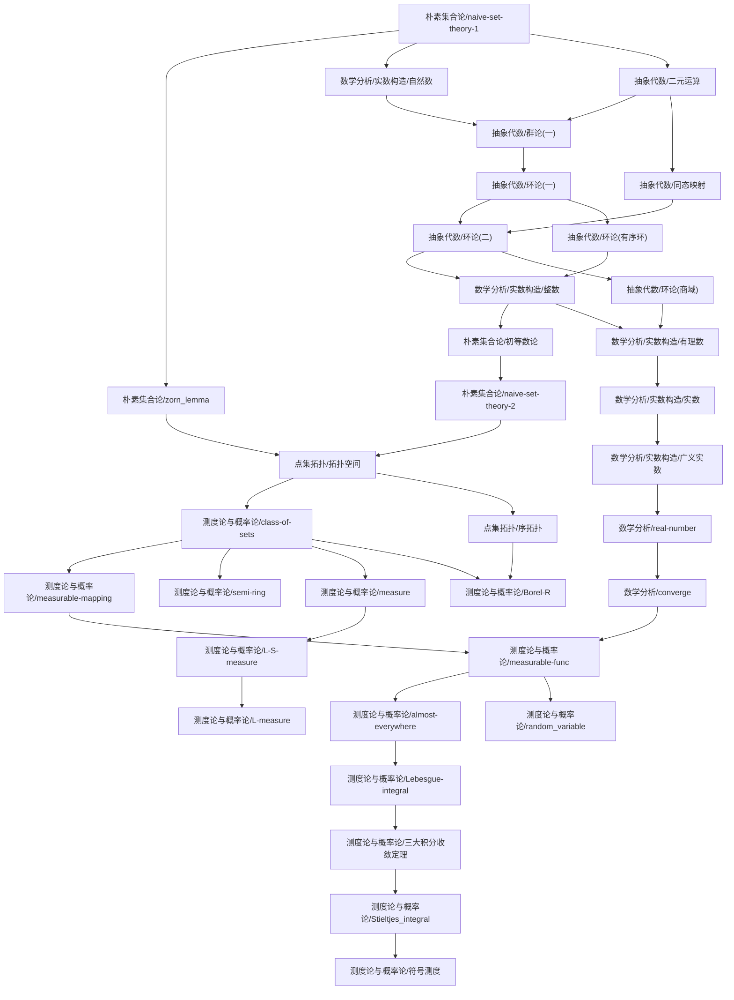

```mermaid
graph TD
1["点集拓扑/拓扑空间"] --> 0["测度论与概率论/class-of-sets"]
3["测度论与概率论/almost-everywhere"] --> 2["测度论与概率论/Lebesgue-integral"]
5["测度论与概率论/Stieltjes_integral"] --> 4["测度论与概率论/符号测度"]
6["测度论与概率论/三大积分收敛定理"] --> 5["测度论与概率论/Stieltjes_integral"]
0["测度论与概率论/class-of-sets"] --> 7["测度论与概率论/measurable-mapping"]
9["测度论与概率论/measure"] --> 8["测度论与概率论/L-S-measure"]
7["测度论与概率论/measurable-mapping"] --> 10["测度论与概率论/measurable-func"]
11["数学分析/converge"] --> 10["测度论与概率论/measurable-func"]
0["测度论与概率论/class-of-sets"] --> 12["测度论与概率论/semi-ring"]
2["测度论与概率论/Lebesgue-integral"] --> 6["测度论与概率论/三大积分收敛定理"]
10["测度论与概率论/measurable-func"] --> 3["测度论与概率论/almost-everywhere"]
10["测度论与概率论/measurable-func"] --> 13["测度论与概率论/random_variable"]
0["测度论与概率论/class-of-sets"] --> 9["测度论与概率论/measure"]
8["测度论与概率论/L-S-measure"] --> 15["测度论与概率论/L-measure"]
0["测度论与概率论/class-of-sets"] --> 16["测度论与概率论/Borel-R"]
17["点集拓扑/序拓扑"] --> 16["测度论与概率论/Borel-R"]
1["点集拓扑/拓扑空间"] --> 17["点集拓扑/序拓扑"]
18["朴素集合论/naive-set-theory-2"] --> 1["点集拓扑/拓扑空间"]
19["朴素集合论/zorn_lemma"] --> 1["点集拓扑/拓扑空间"]
20["朴素集合论/初等数论"] --> 18["朴素集合论/naive-set-theory-2"]
21["朴素集合论/naive-set-theory-1"] --> 19["朴素集合论/zorn_lemma"]
22["数学分析/实数构造/整数"] --> 20["朴素集合论/初等数论"]
23["抽象代数/环论(二)"] --> 22["数学分析/实数构造/整数"]
24["抽象代数/环论(有序环)"] --> 22["数学分析/实数构造/整数"]
25["抽象代数/环论(一)"] --> 23["抽象代数/环论(二)"]
26["抽象代数/同态映射"] --> 23["抽象代数/环论(二)"]
25["抽象代数/环论(一)"] --> 24["抽象代数/环论(有序环)"]
27["抽象代数/群论(一)"] --> 25["抽象代数/环论(一)"]
28["数学分析/实数构造/自然数"] --> 27["抽象代数/群论(一)"]
29["抽象代数/二元运算"] --> 27["抽象代数/群论(一)"]
21["朴素集合论/naive-set-theory-1"] --> 28["数学分析/实数构造/自然数"]
21["朴素集合论/naive-set-theory-1"] --> 29["抽象代数/二元运算"]
29["抽象代数/二元运算"] --> 26["抽象代数/同态映射"]
30["数学分析/real-number"] --> 11["数学分析/converge"]
31["数学分析/实数构造/广义实数"] --> 30["数学分析/real-number"]
32["数学分析/实数构造/实数"] --> 31["数学分析/实数构造/广义实数"]
22["数学分析/实数构造/整数"] --> 33["数学分析/实数构造/有理数"]
34["抽象代数/环论(商域)"] --> 33["数学分析/实数构造/有理数"]
33["数学分析/实数构造/有理数"] --> 32["数学分析/实数构造/实数"]
23["抽象代数/环论(二)"] --> 34["抽象代数/环论(商域)"]
```
