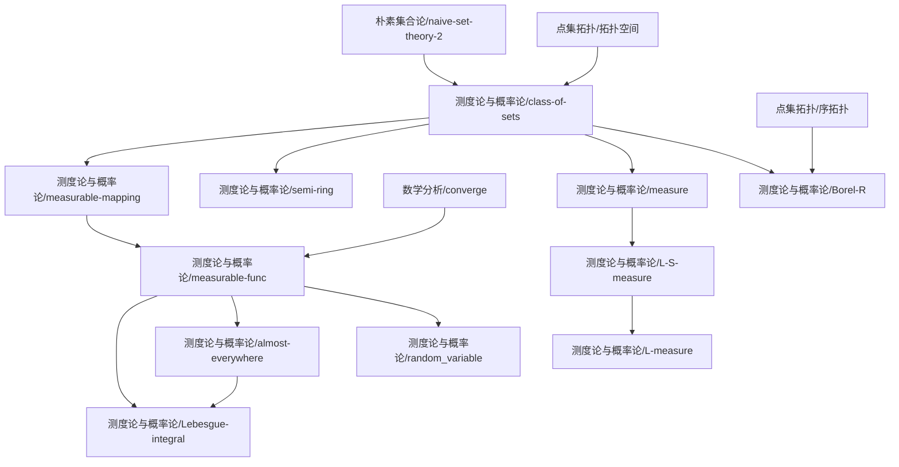

```mermaid
graph TD
1["朴素集合论/naive-set-theory-2"] --> 0["测度论与概率论/class-of-sets"]
2["点集拓扑/拓扑空间"] --> 0["测度论与概率论/class-of-sets"]
4["测度论与概率论/measurable-func"] --> 3["测度论与概率论/Lebesgue-integral"]
5["测度论与概率论/almost-everywhere"] --> 3["测度论与概率论/Lebesgue-integral"]
0["测度论与概率论/class-of-sets"] --> 6["测度论与概率论/measurable-mapping"]
8["测度论与概率论/measure"] --> 7["测度论与概率论/L-S-measure"]
6["测度论与概率论/measurable-mapping"] --> 4["测度论与概率论/measurable-func"]
9["数学分析/converge"] --> 4["测度论与概率论/measurable-func"]
0["测度论与概率论/class-of-sets"] --> 10["测度论与概率论/semi-ring"]
4["测度论与概率论/measurable-func"] --> 5["测度论与概率论/almost-everywhere"]
4["测度论与概率论/measurable-func"] --> 11["测度论与概率论/random_variable"]
0["测度论与概率论/class-of-sets"] --> 8["测度论与概率论/measure"]
7["测度论与概率论/L-S-measure"] --> 13["测度论与概率论/L-measure"]
0["测度论与概率论/class-of-sets"] --> 14["测度论与概率论/Borel-R"]
15["点集拓扑/序拓扑"] --> 14["测度论与概率论/Borel-R"]
```