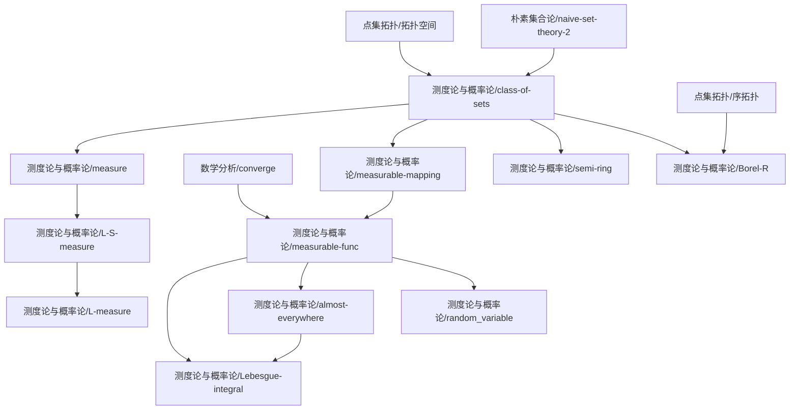

```mermaid
graph TD
1["朴素集合论/naive-set-theory-2"] --> 0["测度论与概率论/class-of-sets"]
2["点集拓扑/拓扑空间"] --> 0["测度论与概率论/class-of-sets"]
4["测度论与概率论/measurable-mapping"] --> 3["测度论与概率论/measurable-func"]
5["数学分析/converge"] --> 3["测度论与概率论/measurable-func"]
7["测度论与概率论/measure"] --> 6["测度论与概率论/L-S-measure"]
3["测度论与概率论/measurable-func"] --> 8["测度论与概率论/random_variable"]
0["测度论与概率论/class-of-sets"] --> 9["测度论与概率论/Borel-R"]
10["点集拓扑/序拓扑"] --> 9["测度论与概率论/Borel-R"]
0["测度论与概率论/class-of-sets"] --> 11["测度论与概率论/semi-ring"]
6["测度论与概率论/L-S-measure"] --> 12["测度论与概率论/L-measure"]
3["测度论与概率论/measurable-func"] --> 13["测度论与概率论/almost-everywhere"]
0["测度论与概率论/class-of-sets"] --> 4["测度论与概率论/measurable-mapping"]
0["测度论与概率论/class-of-sets"] --> 7["测度论与概率论/measure"]
3["测度论与概率论/measurable-func"] --> 14["测度论与概率论/Lebesgue-integral"]
13["测度论与概率论/almost-everywhere"] --> 14["测度论与概率论/Lebesgue-integral"]
```