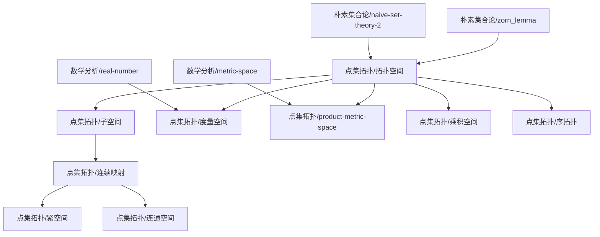

```mermaid
graph TD
1["朴素集合论/naive-set-theory-2"] --> 0["点集拓扑/拓扑空间"]
2["朴素集合论/zorn_lemma"] --> 0["点集拓扑/拓扑空间"]
4["点集拓扑/子空间"] --> 3["点集拓扑/连续映射"]
0["点集拓扑/拓扑空间"] --> 4["点集拓扑/子空间"]
7["数学分析/real-number"] --> 6["点集拓扑/度量空间"]
0["点集拓扑/拓扑空间"] --> 6["点集拓扑/度量空间"]
3["点集拓扑/连续映射"] --> 8["点集拓扑/紧空间"]
10["数学分析/metric-space"] --> 9["点集拓扑/product-metric-space"]
0["点集拓扑/拓扑空间"] --> 9["点集拓扑/product-metric-space"]
3["点集拓扑/连续映射"] --> 11["点集拓扑/连通空间"]
0["点集拓扑/拓扑空间"] --> 12["点集拓扑/乘积空间"]
0["点集拓扑/拓扑空间"] --> 13["点集拓扑/序拓扑"]
```