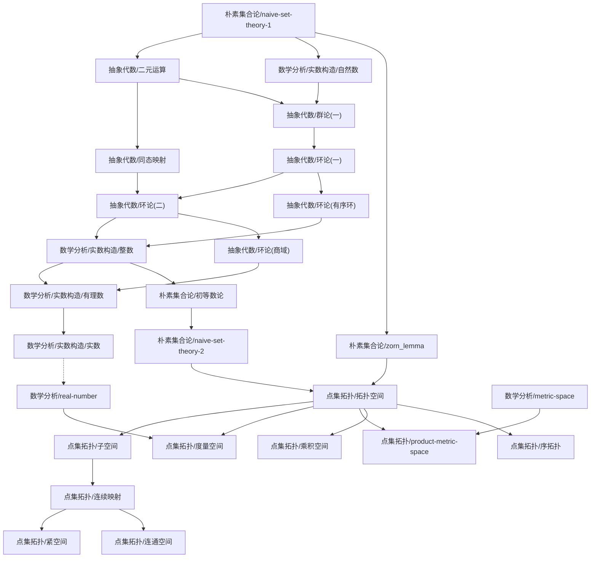

```mermaid
graph TD
1["朴素集合论/naive-set-theory-2"] --> 0["点集拓扑/拓扑空间"]
2["朴素集合论/zorn_lemma"] --> 0["点集拓扑/拓扑空间"]
4["点集拓扑/子空间"] --> 3["点集拓扑/连续映射"]
0["点集拓扑/拓扑空间"] --> 4["点集拓扑/子空间"]
7["数学分析/real-number"] --> 6["点集拓扑/度量空间"]
0["点集拓扑/拓扑空间"] --> 6["点集拓扑/度量空间"]
3["点集拓扑/连续映射"] --> 8["点集拓扑/紧空间"]
10["数学分析/metric-space"] --> 9["点集拓扑/product-metric-space"]
0["点集拓扑/拓扑空间"] --> 9["点集拓扑/product-metric-space"]
3["点集拓扑/连续映射"] --> 11["点集拓扑/连通空间"]
0["点集拓扑/拓扑空间"] --> 12["点集拓扑/乘积空间"]
0["点集拓扑/拓扑空间"] --> 13["点集拓扑/序拓扑"]
14["数学分析/实数构造/实数"] -.-> 7["数学分析/real-number"]
15["数学分析/实数构造/有理数"] --> 14["数学分析/实数构造/实数"]
16["数学分析/实数构造/整数"] --> 15["数学分析/实数构造/有理数"]
17["抽象代数/环论(商域)"] --> 15["数学分析/实数构造/有理数"]
18["抽象代数/环论(二)"] --> 16["数学分析/实数构造/整数"]
19["抽象代数/环论(有序环)"] --> 16["数学分析/实数构造/整数"]
18["抽象代数/环论(二)"] --> 17["抽象代数/环论(商域)"]
20["抽象代数/环论(一)"] --> 18["抽象代数/环论(二)"]
21["抽象代数/同态映射"] --> 18["抽象代数/环论(二)"]
22["抽象代数/群论(一)"] --> 20["抽象代数/环论(一)"]
23["抽象代数/二元运算"] --> 21["抽象代数/同态映射"]
24["朴素集合论/naive-set-theory-1"] --> 23["抽象代数/二元运算"]
25["数学分析/实数构造/自然数"] --> 22["抽象代数/群论(一)"]
23["抽象代数/二元运算"] --> 22["抽象代数/群论(一)"]
24["朴素集合论/naive-set-theory-1"] --> 25["数学分析/实数构造/自然数"]
20["抽象代数/环论(一)"] --> 19["抽象代数/环论(有序环)"]
26["朴素集合论/初等数论"] --> 1["朴素集合论/naive-set-theory-2"]
24["朴素集合论/naive-set-theory-1"] --> 2["朴素集合论/zorn_lemma"]
16["数学分析/实数构造/整数"] --> 26["朴素集合论/初等数论"]
```