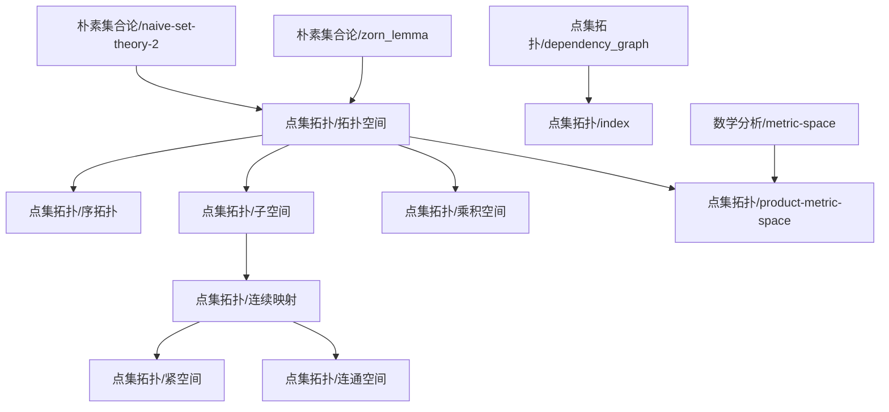

```mermaid
graph TD
1["点集拓扑/连续映射"] --> 0["点集拓扑/紧空间"]
2["点集拓扑/子空间"] --> 1["点集拓扑/连续映射"]
1["点集拓扑/连续映射"] --> 3["点集拓扑/连通空间"]
5["点集拓扑/拓扑空间"] --> 4["点集拓扑/序拓扑"]
7["点集拓扑/dependency_graph"] --> 6["点集拓扑/index"]
5["点集拓扑/拓扑空间"] --> 2["点集拓扑/子空间"]
5["点集拓扑/拓扑空间"] --> 8["点集拓扑/乘积空间"]
9["朴素集合论/naive-set-theory-2"] --> 5["点集拓扑/拓扑空间"]
10["朴素集合论/zorn_lemma"] --> 5["点集拓扑/拓扑空间"]
12["数学分析/metric-space"] --> 11["点集拓扑/product-metric-space"]
5["点集拓扑/拓扑空间"] --> 11["点集拓扑/product-metric-space"]
```