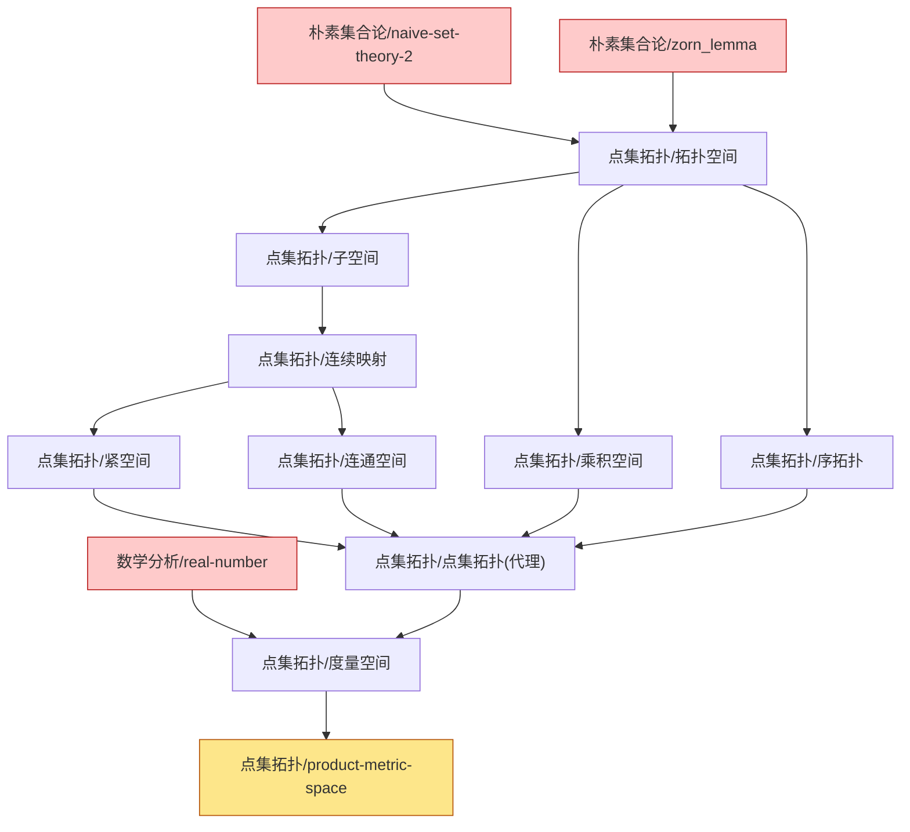

```mermaid
graph TD
1["朴素集合论/naive-set-theory-2"] --> 0["点集拓扑/拓扑空间"]
2["朴素集合论/zorn_lemma"] --> 0["点集拓扑/拓扑空间"]
4["点集拓扑/子空间"] --> 3["点集拓扑/连续映射"]
0["点集拓扑/拓扑空间"] --> 4["点集拓扑/子空间"]
7["数学分析/real-number"] --> 6["点集拓扑/度量空间"]
8["点集拓扑/点集拓扑(代理)"] --> 6["点集拓扑/度量空间"]
3["点集拓扑/连续映射"] --> 9["点集拓扑/紧空间"]
6["点集拓扑/度量空间"] --> 10["点集拓扑/product-metric-space"]
9["点集拓扑/紧空间"] --> 8["点集拓扑/点集拓扑(代理)"]
11["点集拓扑/连通空间"] --> 8["点集拓扑/点集拓扑(代理)"]
12["点集拓扑/乘积空间"] --> 8["点集拓扑/点集拓扑(代理)"]
13["点集拓扑/序拓扑"] --> 8["点集拓扑/点集拓扑(代理)"]
3["点集拓扑/连续映射"] --> 11["点集拓扑/连通空间"]
0["点集拓扑/拓扑空间"] --> 12["点集拓扑/乘积空间"]
0["点集拓扑/拓扑空间"] --> 13["点集拓扑/序拓扑"]
classDef leaf fill:#fde68a,stroke:#b45309
class 10 leaf
classDef root fill:#bfdbfe,stroke:#1d4ed8
class 5 root
classDef externalRoot fill:#fecaca,stroke:#b91c1c
class 1,2,7 externalRoot
```