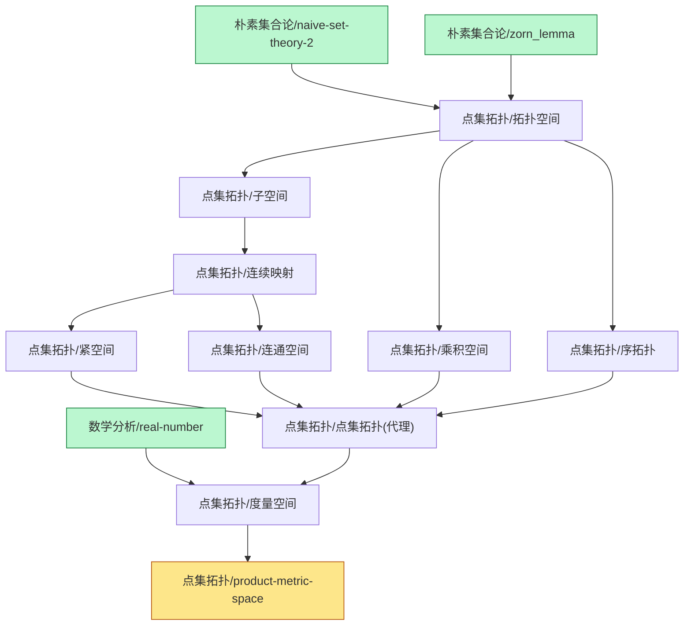

```mermaid
graph TD
1["朴素集合论/naive-set-theory-2"] --> 0["点集拓扑/拓扑空间"]
2["朴素集合论/zorn_lemma"] --> 0["点集拓扑/拓扑空间"]
4["点集拓扑/子空间"] --> 3["点集拓扑/连续映射"]
0["点集拓扑/拓扑空间"] --> 4["点集拓扑/子空间"]
6["数学分析/real-number"] --> 5["点集拓扑/度量空间"]
7["点集拓扑/点集拓扑(代理)"] --> 5["点集拓扑/度量空间"]
3["点集拓扑/连续映射"] --> 8["点集拓扑/紧空间"]
5["点集拓扑/度量空间"] --> 9["点集拓扑/product-metric-space"]
8["点集拓扑/紧空间"] --> 7["点集拓扑/点集拓扑(代理)"]
10["点集拓扑/连通空间"] --> 7["点集拓扑/点集拓扑(代理)"]
11["点集拓扑/乘积空间"] --> 7["点集拓扑/点集拓扑(代理)"]
12["点集拓扑/序拓扑"] --> 7["点集拓扑/点集拓扑(代理)"]
3["点集拓扑/连续映射"] --> 10["点集拓扑/连通空间"]
0["点集拓扑/拓扑空间"] --> 11["点集拓扑/乘积空间"]
0["点集拓扑/拓扑空间"] --> 12["点集拓扑/序拓扑"]
classDef leaf fill:#fde68a,stroke:#b45309
class 9 leaf
classDef foundationRoot fill:#bbf7d0,stroke:#15803d
class 1,2,6 foundationRoot
```