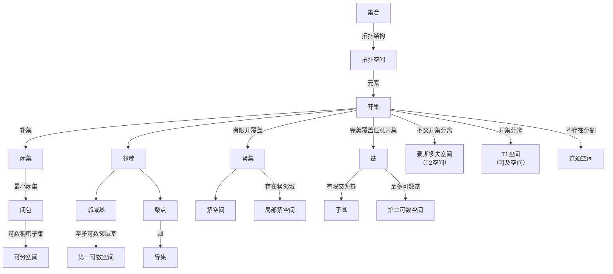

## 前置

- [[数学分析/metric-space]]
- [[朴素集合论/naive-set-theory-2]]
- [[朴素集合论/zorn_lemma]]

## 定义

称$(X,\tau)$为一个拓扑空间，若其满足以下性质，其中$X$ 是一个集合，$\tau$ 是 $X$ 的子集族：

1. $\emptyset, X \in \tau$
2. $\tau$中元素任意并仍在$\tau$中
3. $\tau$中元素有限交仍在$\tau$中

称$U$为$X$的开集(open set)，若$X$的子集$U$满足$U \in \tau$

称$F$为$X$的闭集，若$X$的子集$F$满足$(X \setminus F) \in \tau$

称$U$ 是 $x$ 的邻域(neighborhood)，若存在开集 $V$ 使得 $x \in V \subseteq U$

称$\mathcal{N}_x$是$x$的邻域系(neighborhood system)，若$\mathcal{N}_x$是$x$的所有邻域构成的集合

称$x$为$A\subseteq X$的聚点(accumulation point)，若$x$的任意邻域都含有$A$中异于$x$的点，即$\forall U \in \mathcal{N}_x, A \setminus \{x\} \bigcap N \not= \emptyset$

称$A^d$为$A$的导集(derived set)，若$A^d = \{x \in X \mid x$为$A$的聚点$\}$

称$\overline{A}$为$A$的闭包(closure)，若$\overline{A}=\bigcap{\{F \subseteq X \mid F \text{是包含} A \text{的闭集}\}}$，即包含 $A$ 的最小闭集

称$A$为紧集(compact set)，若$A$的任意开覆盖都有有限子覆盖，即若$A \subseteq \bigcup_{i \in I} U_i$，其中$U_i \in \tau$,存在有限集$J \subseteq I$，使得$A \subseteq \bigcup_{i \in J} U_i$

称$X$为紧空间(compact space)，若$X$为紧集

称$\mathcal{B}\subseteq \tau$ 是拓扑空间$X$的基(base), 若$\forall U\in \tau, \exists \mathcal{B}_U \subseteq \mathcal{B}$ 使得 $U = \bigcup \mathcal{B}_U$

称$\mathcal{S}$ 是拓扑空间$X$的子基(subbase)，若$\mathcal{S}$的有限交集族是$X$的基

称$\{x_n\}_{n=1}^\infty$收敛到$x$，若对于任意$x$的邻域$U$，存在$N$，使得$x_n \in U, \forall n \geq N$

称$\mathcal{B}_x \subseteq \mathcal{N}_x$是$x$的邻域基(neighborhood base)，若$\forall N \in \mathcal{N}_x, \exists V \in \mathcal{B}_x$ 使得 $V \subseteq N$

称$X$为第一可数空间(first countable space)，若对于$X$的每个点，都存在一个至多可数的邻域基

称$X$为第二可数空间(second countable space)，若$X$的拓扑空间有可数基

称$B$在$A$中稠密(dense)，若$A\subseteq \overline{B}$，即$A$中每一点的任意邻域中都有$B$中的点

称$X$为可分(separable)空间，若$\{A\subseteq X| A \text{ 在} X \text{中稠密}\}$至多可数。

称$X$为豪斯多夫空间(Hausdorff space)，又称分离空间或$T_2$空间（separated space or $T_2$ space），若$X$中任意两点$x,y$，存在$x$的开集$U$和$y$的开集$V$，使得$x \in U, y \in V, U \cap V = \emptyset$

称$X$为$T_1$空间(Fréchet space)，又称为可及空间(accessible space)，若$X$中任意两点$x,y$，存在$x$的开集$U$和$y$的开集$V$，使得$x \in U, y \notin U, y \in V, x \notin V$，即任意两点可分离 (这里不要求两个开集不相交，只是单向排除对方。)

称$U,V$为$(X,\tau)$的分割(separation)，若$U\in \tau \wedge V\in \tau \wedge U\cap V=\emptyset \wedge U\cup V=X$

称$(X,\tau)$为连通空间(connected space)，若$(X,\tau)$不存在分割

称$X$为局部紧空间(locally compact space)，若对于任意$x\in X$，存在开集$U$和紧集$K$，使得$x\in U \subseteq K \subseteq X$

称$A$在$X$中是预紧的(precompact)，若$A$的闭包在$X$中是紧集

称$X$为正规空间(normal space)，若$X$中任意两个不交闭集$A,B$，存在不交开集$U,V$，使得$A\subseteq U,B\subseteq V$，即$A\cap B=\emptyset$

称$X$为 Lindelöf 空间(Lindelöf space)，若$X$中任意开覆盖都有可数子覆盖

称$X$为可数紧空间(countably compact space)，若$X$中任意可数开覆盖都有有限子覆盖

称$A\subseteq X$为列紧集(sequentially compact set)，若$A$中任意序列都有收敛的子序列（极限不必在$A$中）

## 性质

1. $U$ 是开集的等价定义 $\iff$ 对于任意$x\in U$,$U$ 是 $x$ 的邻域
2. $\mathcal{B}$ 是基 $\iff$ 对于任意$x\in U \in \tau$，存在$B\in \mathcal{B}$，使得$x\in B\subseteq U$
3. $\overline{A}=A\cup A^d$
4. 拓扑空间中有序列收敛到$x$ $\iff$ $x$ 为聚点。
5. 若$X$为非空集合，$B\subseteq X$，如果$\mathcal{B}$是$B$的$X$上的某个拓扑的基，则 1)$\bigcup_{B\in \mathcal{B}}B=X$，2)$\forall B_1,B_2 \in \mathcal{B}$，$x\in B_1 \cap B_2 \Rightarrow \exists B_3 \in \mathcal{B}$，使得$x\in B_3 \subseteq B_1 \cap B_2$. 如果$\mathcal{E}$满足性质 1)和 2),则存在唯一拓扑$\tau=\{G\subseteq X \mid \exists \mathcal{E}_G \subseteq \mathcal{E}, G=\bigcup \mathcal{E}_G\}$以$\mathcal{E}$为基。
6. 若$X$为非空集合，$\mathcal{S}\subseteq \mathcal{P}(X) \wedge X = \bigcup_{S\in \mathcal{S}} S$，则存在唯一拓扑以 $\mathcal{S}$ 为子基。
7. 若$X$为第一可数空间，则$x\in X^d \iff A\backslash\{x\}$中有序列收敛于$x$
8. $N\in \mathcal{N}_x \iff \exists N_1 \in \mathcal{N}_x, N_1 \subseteq N$
9. 第二可数空间都是第一可数空间
10. 第二可数空间都是可分空间
11. 拓扑空间$X$为$T_1$空间 $\iff$ $X$的任意单点集为闭集。
12. $T_1$空间中，$A\subseteq X,x\in A^d \iff \forall U\in \mathcal{N}_x,U\cap A \text{是无限集}$
13. 拓扑空间为 Hausdorff 空间 $\iff$ 对角线$\Delta = \{(x,x) \mid x \in X\}$为闭集
14. Hausdorff 空间中极限唯一
15. $X$为紧空间 $\iff$ 具有有限交性质的闭集族的交不空
16. 设$X$为 Hausdorff 空间，$K$和$L$为$X$的紧集，且$K\cap L=\emptyset$，则存在开集$U,V$，使得$K\subseteq U,L\subseteq V,U\cap V=\emptyset$
17. 设$X$为拓扑空间，$\mathcal{S}$为$X$的一个子基，则($X$为紧空间 $\iff$ 任何由$\mathcal{S}$的子集所构成的开覆盖都有有限的子覆盖)
18. 第二可数空间都是 Lindelöf 空间
19. $X$为可数紧空间，$A$是$X$的无限子集，则$A^d\not= \emptyset$
20. $K$紧，$U$开，则$K\backslash U$紧
21. 紧集的闭子集为紧集
22. 可数紧集的闭子集为可数紧集
23. 紧集都是列紧的
24. 紧 Hausdorff 空间为 正规空间
25. Hausdorff 空间中，紧集都是闭集
26. 设$X$为 Hausdorff 空间，$K$为$X$的紧集，$U_1,U_2$均为$X$的开集，且$K\subseteq U_1 \cup U_2$，则存在紧集$K_1,K_2$，使得$K_1 \subseteq U_1,K_2 \subseteq U_2,K=K_1 \cup K_2$
27. 第一可数空间中，紧 $\Rightarrow$ 列紧
28. 第二可数空间的任何基都存在一个子集为可数基
29. $X$不连通 $\iff$ $X$存在既开又闭的非空真子集
