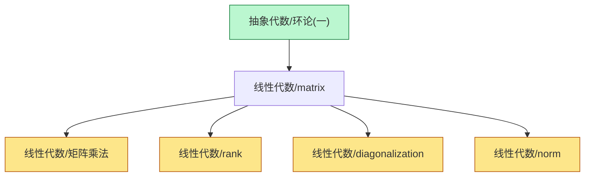

```mermaid
graph TD
1["线性代数/matrix"] --> 0["线性代数/矩阵乘法"]
1["线性代数/matrix"] --> 2["线性代数/rank"]
3["抽象代数/环论(一)"] --> 1["线性代数/matrix"]
1["线性代数/matrix"] --> 4["线性代数/diagonalization"]
1["线性代数/matrix"] --> 5["线性代数/norm"]
classDef leaf fill:#fde68a,stroke:#b45309
class 0,2,4,5 leaf
classDef foundationRoot fill:#bbf7d0,stroke:#15803d
class 3 foundationRoot
```