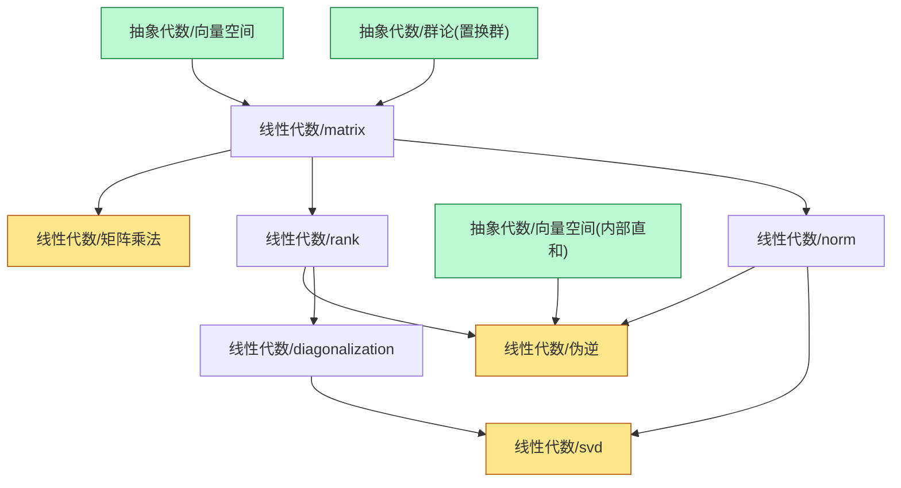

```mermaid
graph TD
1["线性代数/rank"] --> 0["线性代数/伪逆"]
2["线性代数/norm"] --> 0["线性代数/伪逆"]
3["抽象代数/向量空间(内部直和)"] --> 0["线性代数/伪逆"]
5["线性代数/matrix"] --> 4["线性代数/矩阵乘法"]
5["线性代数/matrix"] --> 1["线性代数/rank"]
6["抽象代数/向量空间"] --> 5["线性代数/matrix"]
7["抽象代数/群论(置换群)"] --> 5["线性代数/matrix"]
1["线性代数/rank"] --> 8["线性代数/diagonalization"]
8["线性代数/diagonalization"] --> 9["线性代数/svd"]
2["线性代数/norm"] --> 9["线性代数/svd"]
5["线性代数/matrix"] --> 2["线性代数/norm"]
classDef leaf fill:#fde68a,stroke:#b45309
class 0,4,9 leaf
classDef foundationRoot fill:#bbf7d0,stroke:#15803d
class 3,6,7 foundationRoot
```