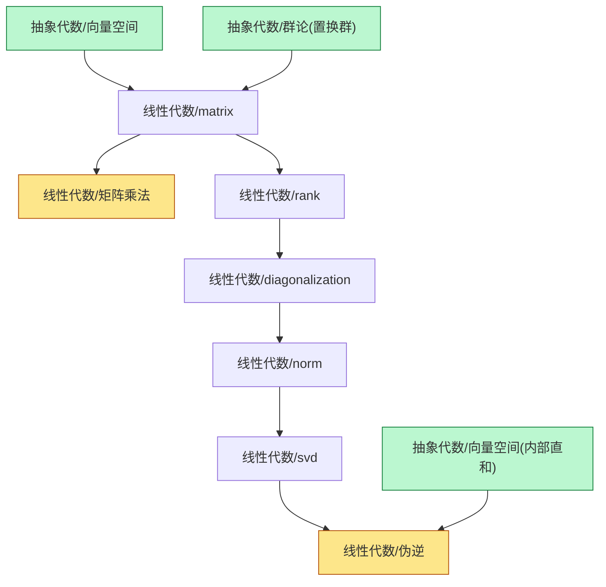

```mermaid
graph TD
1["线性代数/svd"] --> 0["线性代数/伪逆"]
2["抽象代数/向量空间(内部直和)"] --> 0["线性代数/伪逆"]
4["线性代数/matrix"] --> 3["线性代数/矩阵乘法"]
4["线性代数/matrix"] --> 5["线性代数/rank"]
6["抽象代数/向量空间"] --> 4["线性代数/matrix"]
7["抽象代数/群论(置换群)"] --> 4["线性代数/matrix"]
5["线性代数/rank"] --> 8["线性代数/diagonalization"]
9["线性代数/norm"] --> 1["线性代数/svd"]
8["线性代数/diagonalization"] --> 9["线性代数/norm"]
classDef leaf fill:#fde68a,stroke:#b45309
class 0,3 leaf
classDef foundationRoot fill:#bbf7d0,stroke:#15803d
class 2,6,7 foundationRoot
click 0 "/线性代数/伪逆" "线性代数/伪逆"
click 1 "/线性代数/svd" "线性代数/svd"
click 2 "/抽象代数/向量空间(内部直和)" "抽象代数/向量空间(内部直和)"
click 3 "/线性代数/矩阵乘法" "线性代数/矩阵乘法"
click 4 "/线性代数/matrix" "线性代数/matrix"
click 5 "/线性代数/rank" "线性代数/rank"
click 6 "/抽象代数/向量空间" "抽象代数/向量空间"
click 7 "/抽象代数/群论(置换群)" "抽象代数/群论(置换群)"
click 8 "/线性代数/diagonalization" "线性代数/diagonalization"
click 9 "/线性代数/norm" "线性代数/norm"
```