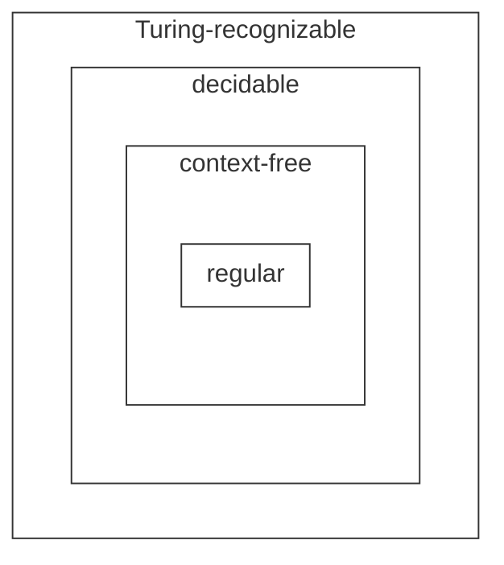

- [1. 图灵机的(等价)变体](#1-图灵机的等价变体)
  - [1.1. 逗留(stay)图灵机](#11-逗留stay图灵机)
  - [1.2. 不同符号图灵机](#12-不同符号图灵机)

#### 1. Turing machine

A $\textit{Turing machine}$ is a 7-tuple, $(Q,\Sigma,\Gamma,\delta,q_0,q_{\text{accept}},q_{\text{reject}})$, where $Q,\Sigma,\Gamma$ are all finite sets and

1. $Q$ is the set of states,
2. $\Sigma$ is the input alphabet not containing the $\textit{blank symbol}$ $\sqcup$,
3. $\Gamma$ is the tape alphabet, where $\sqcup \in \Gamma$ and $\Sigma \subseteq \Gamma$,
4. $\delta: Q \times \Gamma \longrightarrow Q \times \Gamma \times \{L,R\}$ is the transition function,
5. $q_0 \in Q$ is the start state,
6. $q_{\text{accept}} \in Q$ is the accept state, and
7. $q_{\text{reject}} \in Q$ is the reject state, where $q_{\text{reject}} \neq q_{\text{accept}}$.

input string belongs to $\Sigma^*$

A Turing machine $M$ **accepts** input $w$ if a sequence of configurations $C_1, C_2, \cdots, C_k$ exists, where

1. $C_1$ is the start configuration of $M$ on input $w$,
2. each $C_i$ yields $C_{i+1}$, and
3. $C_k$ is an accepting configuration.

The collection of strings that $M$ accepts is the language of $M$, or the language recognized by $M$, denoted $L(M)$.

If a Turing machine can always enter the accepting state or the rejecting state after a finite number of state transitions for all inputs, then the Turing machine is called **decider**.

A decider that recognizes some language also is said to **decide** that language. Call a language **Turing-decidable** or simply **decidable** if some Turing machine decides it.

## 1. 图灵机的(等价)变体

$\pi$表示投影映射，$\pi_i$表示取第一个分量

例如，若$\delta(q,a)=(q',b,R)$，则$\pi_1(\delta(q,a))=\pi_1(q',b,R)=q'$

$I_Q$表示$Q$的指标集

#### 1.1. 逗留(stay)图灵机

A $\textit{Turing machine}$ is a 7-tuple, $(Q,\Sigma,\Gamma,\delta,q_0,q_{\text{accept}},q_{\text{reject}})$, where $Q,\Sigma,\Gamma$ are all finite sets and

1. $Q$ is the set of states,
2. $\Sigma$ is the input alphabet not containing the $\textit{blank symbol}$ $\sqcup$,
3. $\Gamma$ is the tape alphabet, where $\sqcup \in \Gamma$ and $\Sigma \subseteq \Gamma$,
4. $\delta: Q \times \Gamma \longrightarrow Q \times \Gamma \times \{L,R,S\}$ is the transition function,
5. $q_0 \in Q$ is the start state,
6. $q_{\text{accept}} \in Q$ is the accept state, and
7. $q_{\text{reject}} \in Q$ is the reject state, where $q_{\text{reject}} \neq q_{\text{accept}}$.

任意逗留图灵机都可用一个原始图灵机模拟。

构造等价的原始图灵机：

对于任意状态$q_i$和符号$x\in \Gamma$，定义新的状态$q_{i,x,S}$，转移函数如下

- $\forall a,x \in \Gamma,i\in I_Q, \delta'(q_{1,a,S},x):=(\pi_1(\delta(q_1,a)),x,L)$
- if $\delta(q_{1},a)=(q_{2},b,S)$
  - $\delta'(q_{1},a):=(q_{1,a,S},b,R)$
- if $\delta(q_{1},a)=(q_{2},b,L)$
  - $\delta'(q_{1},a):=(q_{2},b,L)$
- if $\delta(q_{1},a)=(q_{2},b,R)$
  - $\delta'(q_{1},a):=(q_{2},b,R)$

#### 1.2. 不同符号图灵机

将设有两个图灵机$M_1$和$M_2$，它们有不同符号集$\Gamma_1$和$\Gamma_2$

有不同符号集的图灵机$M_1$和$M_2$是可以互相模拟。

不失一般地，用$M_1$模拟$M_2$

若$|\Gamma_1|=b$,则可将$\omega \in \Gamma_1^*$看作$b$进制数，并用$b$进制数编码$\Gamma_1$的符号。

至多使用$k = \lceil \log_b(|\Gamma_1|) \rceil$个符号，即可编码$\Gamma_1$的符号。

定义集合$[k]=\{0,1,2,\cdots,k-1\}$

定义集合$A=\{\omega \in \Gamma_1^* \mid |\omega|=k\}$

定义集合$B=\{read, right,left\}$

定义状态$q_{i,\omega,stage,j}$，其中$i\in I_Q,\omega \in A,stage \in B,j\in [k]$

定义转移函数$\delta'$
