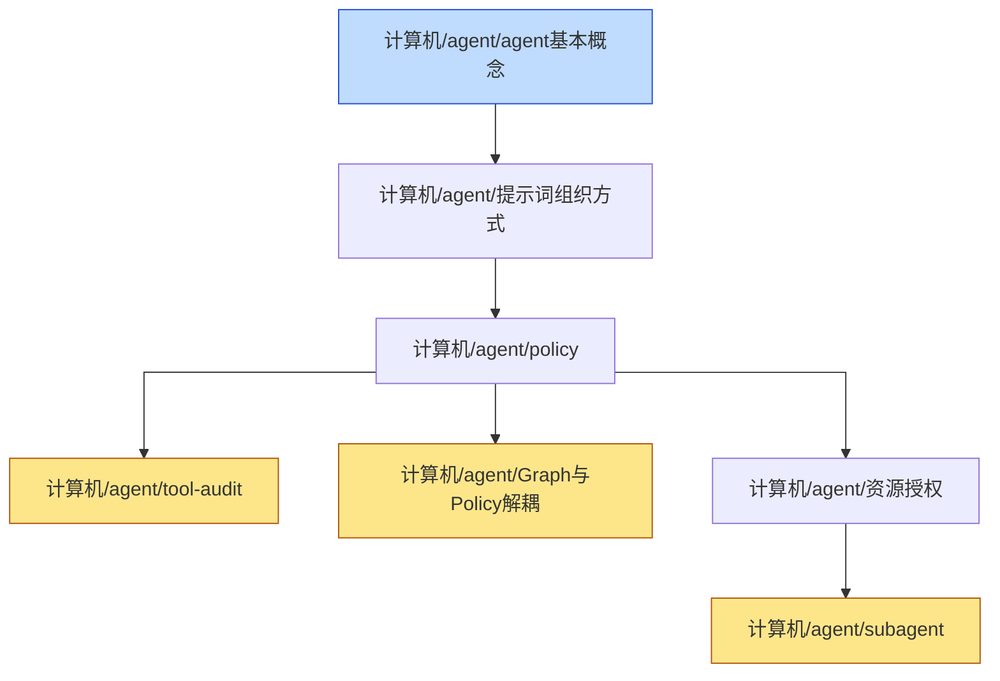

```mermaid
%%{init: {'flowchart': {'curve': 'stepAfter'}}}%%
graph TD
1["计算机/agent/policy"] --> 0["计算机/agent/tool-audit"]
1["计算机/agent/policy"] --> 2["计算机/agent/Graph与Policy解耦"]
4["计算机/agent/资源授权"] --> 3["计算机/agent/subagent"]
6["计算机/agent/agent基本概念"] --> 5["计算机/agent/提示词组织方式"]
5["计算机/agent/提示词组织方式"] --> 1["计算机/agent/policy"]
1["计算机/agent/policy"] --> 4["计算机/agent/资源授权"]
classDef leaf fill:#fde68a,stroke:#b45309
class 0,2,3 leaf
classDef root fill:#bfdbfe,stroke:#1d4ed8
class 6 root
click 0 "/计算机/agent/tool-audit" "计算机/agent/tool-audit"
click 1 "/计算机/agent/policy" "计算机/agent/policy"
click 2 "/计算机/agent/graph与policy解耦" "计算机/agent/Graph与Policy解耦"
click 3 "/计算机/agent/subagent" "计算机/agent/subagent"
click 4 "/计算机/agent/资源授权" "计算机/agent/资源授权"
click 5 "/计算机/agent/提示词组织方式" "计算机/agent/提示词组织方式"
click 6 "/计算机/agent/agent基本概念" "计算机/agent/agent基本概念"
```