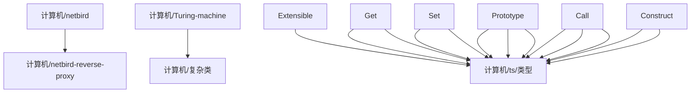

```mermaid
graph TD
1["计算机/netbird"] --> 0["计算机/netbird-reverse-proxy"]
3["计算机/Turing-machine"] --> 2["计算机/复杂类"]
7["Prototype"] --> 6["计算机/ts/类型"]
8["Extensible"] --> 6["计算机/ts/类型"]
9["Get"] --> 6["计算机/ts/类型"]
10["Set"] --> 6["计算机/ts/类型"]
9["Get"] --> 6["计算机/ts/类型"]
10["Set"] --> 6["计算机/ts/类型"]
11["Call"] --> 6["计算机/ts/类型"]
12["Construct"] --> 6["计算机/ts/类型"]
7["Prototype"] --> 6["计算机/ts/类型"]
11["Call"] --> 6["计算机/ts/类型"]
11["Call"] --> 6["计算机/ts/类型"]
12["Construct"] --> 6["计算机/ts/类型"]
7["Prototype"] --> 6["计算机/ts/类型"]
```