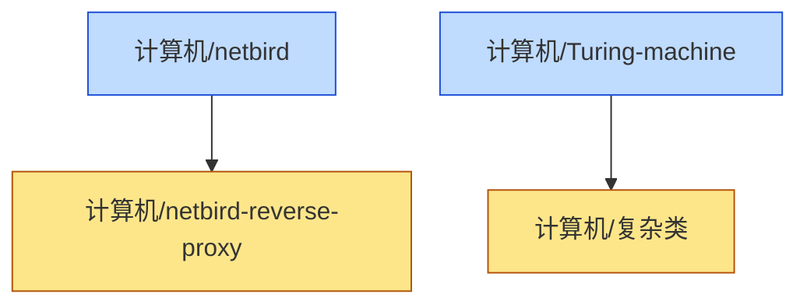

```mermaid
graph TD
1["计算机/netbird"] --> 0["计算机/netbird-reverse-proxy"]
3["计算机/Turing-machine"] --> 2["计算机/复杂类"]
classDef leaf fill:#fde68a,stroke:#b45309
class 0,2 leaf
classDef root fill:#bfdbfe,stroke:#1d4ed8
class 1,3 root
```