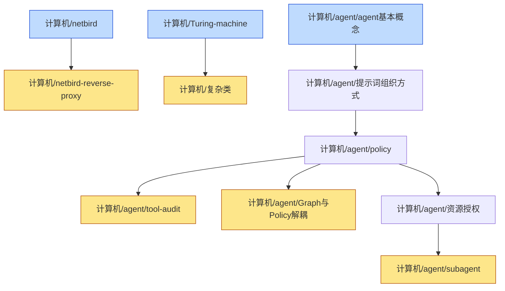

```mermaid
graph TD
1["计算机/netbird"] --> 0["计算机/netbird-reverse-proxy"]
3["计算机/Turing-machine"] --> 2["计算机/复杂类"]
5["计算机/agent/policy"] --> 4["计算机/agent/tool-audit"]
5["计算机/agent/policy"] --> 6["计算机/agent/Graph与Policy解耦"]
8["计算机/agent/资源授权"] --> 7["计算机/agent/subagent"]
10["计算机/agent/agent基本概念"] --> 9["计算机/agent/提示词组织方式"]
9["计算机/agent/提示词组织方式"] --> 5["计算机/agent/policy"]
5["计算机/agent/policy"] --> 8["计算机/agent/资源授权"]
classDef leaf fill:#fde68a,stroke:#b45309
class 0,2,4,6,7 leaf
classDef root fill:#bfdbfe,stroke:#1d4ed8
class 1,3,10 root
click 0 "/计算机/netbird-reverse-proxy" "计算机/netbird-reverse-proxy"
click 1 "/计算机/netbird" "计算机/netbird"
click 2 "/计算机/复杂类" "计算机/复杂类"
click 3 "/计算机/turing-machine" "计算机/Turing-machine"
click 4 "/计算机/agent/tool-audit" "计算机/agent/tool-audit"
click 5 "/计算机/agent/policy" "计算机/agent/policy"
click 6 "/计算机/agent/graph与policy解耦" "计算机/agent/Graph与Policy解耦"
click 7 "/计算机/agent/subagent" "计算机/agent/subagent"
click 8 "/计算机/agent/资源授权" "计算机/agent/资源授权"
click 9 "/计算机/agent/提示词组织方式" "计算机/agent/提示词组织方式"
click 10 "/计算机/agent/agent基本概念" "计算机/agent/agent基本概念"
```