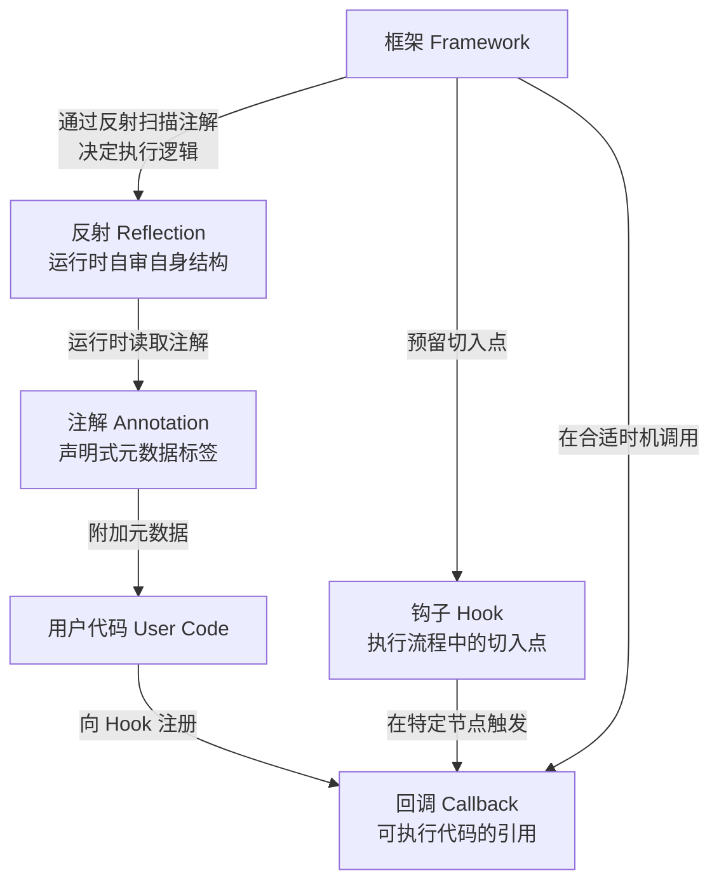

## 核心概念

**反射（Reflection）**：程序在运行时检查并操作自身结构（类、方法、字段、注解等）的能力。通过反射，代码可以在不提前知道具体类型的情况下，动态获取元数据、调用方法或创建对象。是注解机制得以在运行时生效的底层支撑。

**注解（Annotation）**：声明式元数据标签，附加在代码元素（类、方法、字段）上，本身不含执行逻辑，由外部框架在编译期或运行时通过反射读取并处理。

**回调（Callback）**：一段可执行代码的引用（函数指针、委托、函数对象），由调用方传入，供被调用方在合适时机主动触发。

**钩子（Hook）**：框架或系统在执行流程中预留的切入点，允许外部代码在特定节点注入自定义逻辑。Hook 内部注册的处理函数本质上是一种回调。

## 四者关系

## 四者对比

| 特性         | 反射（Reflection）   | 注解（Annotation）       | 回调（Callback）       | 钩子（Hook）                     |
| ------------ | -------------------- | ------------------------ | ---------------------- | -------------------------------- |
| **本质**     | 运行时自审机制       | 声明式元数据（标签）     | 对象引用 / 函数指针    | 执行流程中的切入点               |
| **生命周期** | 运行时               | 编译期、类加载期或运行时 | 程序运行期间           | 程序运行期间                     |
| **耦合度**   | 低（解耦类型与逻辑） | 极低（只声明意图）       | 较高（需显式传入）     | 中（在框架预留位置填入逻辑）     |
| **控制流**   | 程序主动查询自身结构 | 框架通过反射发现并处理   | 被调用者主动触发调用者 | 框架在特定节点调用注册的处理函数 |
