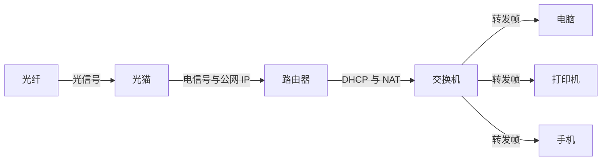
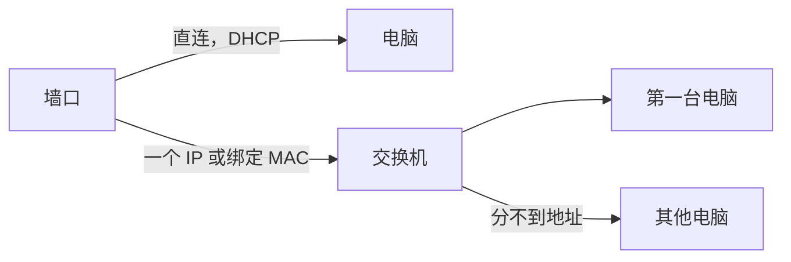
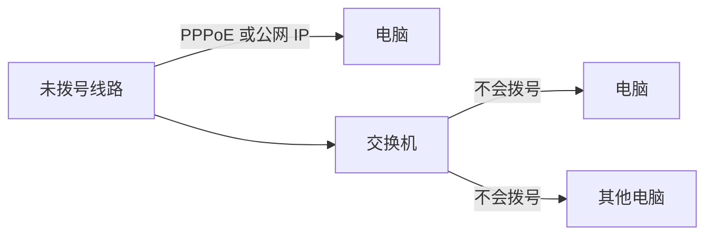

光猫把入户线路变成可以认证的以太网，路由器（或自带路由的光猫）完成拨号并分配内网地址，交换机把已经能上网的网口扩展成多个。

## 光猫、路由器、交换机

PPPoE（Point-to-Point Protocol over Ethernet，以太网上的点对点协议）是家用宽带的拨号方式。光猫、路由器或电脑把宽带账号和密码放进以太网帧发给运营商，核验通过后，运营商给这一次连接分配一个公网 IP。一次拨号对应一个公网 IP。

光纤里走的是光信号，电脑和交换机走的是电信号。光猫做两件事：

- 把光信号转换成电信号
- 用宽带账号向运营商完成认证，拿到一个公网 IP

拿到公网 IP 之后，路由功能（很多光猫已经内置，也可以单独用一台路由器）继续做这几件事：

- 建立局域网，用 DHCP 给每台设备分配内网地址，例如 `192.168.1.x`
- 用这一个公网 IP 把多台内网设备的流量送出去（NAT）
- 需要无线时提供 Wi-Fi

拨号和 DHCP 由光猫或路由器完成。交换机只转发帧，上游还没分好地址时，多接几台电脑也上不了网。

## 接线

光猫是路由一体机、已经拨号并打开 DHCP 时：

光猫只做桥接、拨号在路由器上时：

入户线直接进普通交换机，再分给多台电脑，这些电脑都拿不到地址。

## 问题记录

电脑直连墙上的网口能上网，经过交换机后不能。

可能的原因：

- 情况1:上游已经拨好号。
  - 墙口来自路由器或光猫的 LAN，DHCP 已经开着。接到交换机上通常也能上。上不了，可能是上游一个口只给一个 IP，或绑定了第一台电脑的 MAC。

- 情况2:这根线还没拨号。
  - 另一头是运营商，或一台还没拨号的光猫。电脑自己做 PPPoE，或直接要那一个公网 IP，所以直连能上。交换机不会拨号，也不能把这一个公网 IP 分给多台电脑。

## 关于网线颜色

从传输功能来说，黑色与蓝色没区别。