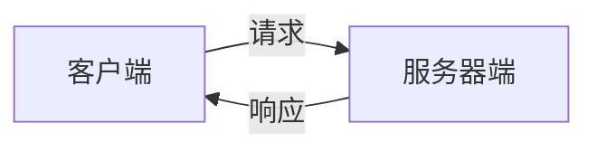
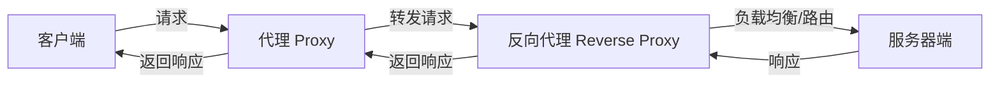

## 基本模型

```mermaid
flowchart LR
    C[客户端]
    S[服务器端]

    C -->|请求| S
    S -->|响应| C
```

## 代理

```mermaid
flowchart LR
    C[客户端]
    P[代理 Proxy]
    RP[反向代理 Reverse Proxy]
    S[服务器端]

    C -->|请求| P
    P -->|转发请求| RP
    RP -->|负载均衡/路由| S
    S -->|响应| RP
    RP -->|返回响应| P
    P -->|返回响应| C
```
