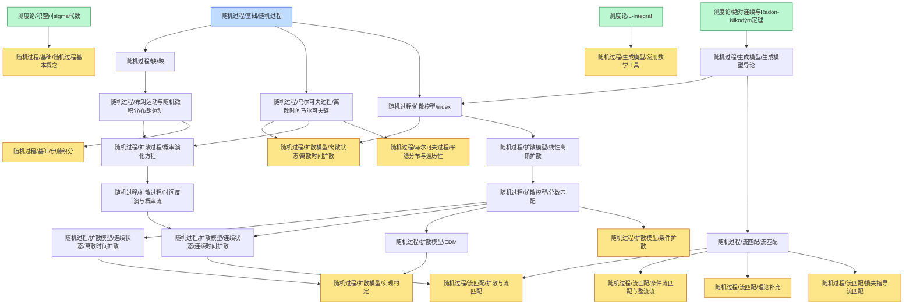

```mermaid
graph TD
1["随机过程/流匹配/流匹配"] --> 0["随机过程/流匹配/损失指导流匹配"]
1["随机过程/流匹配/流匹配"] --> 2["随机过程/流匹配/理论补充"]
1["随机过程/流匹配/流匹配"] --> 3["随机过程/流匹配/条件流匹配与整流流"]
5["随机过程/扩散模型/连续状态/连续时间扩散"] --> 4["随机过程/流匹配/扩散与流匹配"]
1["随机过程/流匹配/流匹配"] --> 4["随机过程/流匹配/扩散与流匹配"]
6["随机过程/生成模型/生成模型导论"] --> 1["随机过程/流匹配/流匹配"]
8["随机过程/扩散模型/连续状态/离散时间扩散"] --> 7["随机过程/扩散模型/实现约定"]
9["随机过程/扩散模型/EDM"] --> 7["随机过程/扩散模型/实现约定"]
11["随机过程/扩散模型/index"] --> 10["随机过程/扩散模型/线性高斯扩散"]
13["随机过程/扩散模型/分数匹配"] --> 12["随机过程/扩散模型/条件扩散"]
10["随机过程/扩散模型/线性高斯扩散"] --> 13["随机过程/扩散模型/分数匹配"]
14["随机过程/基础/随机过程"] --> 11["随机过程/扩散模型/index"]
6["随机过程/生成模型/生成模型导论"] --> 11["随机过程/扩散模型/index"]
13["随机过程/扩散模型/分数匹配"] --> 9["随机过程/扩散模型/EDM"]
14["随机过程/基础/随机过程"] --> 15["随机过程/马尔可夫过程/离散时间马尔可夫链"]
15["随机过程/马尔可夫过程/离散时间马尔可夫链"] --> 16["随机过程/马尔可夫过程/平稳分布与遍历性"]
18["测度论/积空间sigma代数"] --> 17["随机过程/基础/随机过程基本概念"]
20["随机过程/布朗运动与随机微积分/布朗运动"] --> 19["随机过程/基础/伊藤积分"]
21["随机过程/鞅/鞅"] --> 20["随机过程/布朗运动与随机微积分/布朗运动"]
14["随机过程/基础/随机过程"] --> 21["随机过程/鞅/鞅"]
22["测度论/绝对连续与Radon-Nikodým定理"] --> 6["随机过程/生成模型/生成模型导论"]
24["测度论/L-integral"] --> 23["随机过程/生成模型/常用数学工具"]
15["随机过程/马尔可夫过程/离散时间马尔可夫链"] --> 25["随机过程/扩散过程/概率演化方程"]
20["随机过程/布朗运动与随机微积分/布朗运动"] --> 25["随机过程/扩散过程/概率演化方程"]
25["随机过程/扩散过程/概率演化方程"] --> 26["随机过程/扩散过程/时间反演与概率流"]
13["随机过程/扩散模型/分数匹配"] --> 5["随机过程/扩散模型/连续状态/连续时间扩散"]
26["随机过程/扩散过程/时间反演与概率流"] --> 5["随机过程/扩散模型/连续状态/连续时间扩散"]
13["随机过程/扩散模型/分数匹配"] --> 8["随机过程/扩散模型/连续状态/离散时间扩散"]
11["随机过程/扩散模型/index"] --> 27["随机过程/扩散模型/离散状态/离散时间扩散"]
15["随机过程/马尔可夫过程/离散时间马尔可夫链"] --> 27["随机过程/扩散模型/离散状态/离散时间扩散"]
classDef leaf fill:#fde68a,stroke:#b45309
class 0,2,3,4,7,12,16,17,19,23,27 leaf
classDef root fill:#bfdbfe,stroke:#1d4ed8
class 14 root
classDef foundationRoot fill:#bbf7d0,stroke:#15803d
class 18,22,24 foundationRoot
```