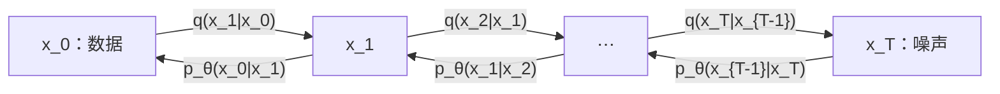

## 前置

- [[随机过程/扩散模型/分数匹配]]

## 1. DDPM 的两条链

设数据 $\mathbf x_0\in\mathbb R^d$ 服从 $q_{\mathrm{data}}$。DDPM
[@ho2020denoising] 用固定的非齐次高斯马尔可夫链逐步加噪：

$$
q(\mathbf x_{1:T}\mid\mathbf x_0)
=\prod_{t=1}^Tq(\mathbf x_t\mid\mathbf x_{t-1}),
$$

其中给定噪声日程 $0<\beta_t<1$，

$$
q(\mathbf x_t\mid\mathbf x_{t-1})
=\mathcal N\!\left(
\mathbf x_t;
\sqrt{1-\beta_t}\,\mathbf x_{t-1},
\beta_t\mathbf I
\right).
$$

记

$$
\alpha_t:=1-\beta_t,
\qquad
\bar\alpha_t:=\prod_{s=1}^t\alpha_s,
\qquad
\bar\alpha_0:=1.
$$

则一步重参数化为

$$
\mathbf x_t
=\sqrt{\alpha_t}\,\mathbf x_{t-1}
+\sqrt{1-\alpha_t}\,\boldsymbol\epsilon_t,
\qquad
\boldsymbol\epsilon_t\sim\mathcal N(\mathbf0,\mathbf I).
$$

逆向生成链由模型给出：

$$
p_\theta(\mathbf x_{0:T})
=p(\mathbf x_T)
\prod_{t=1}^T
p_\theta(\mathbf x_{t-1}\mid\mathbf x_t),
\qquad
p(\mathbf x_T)=\mathcal N(\mathbf0,\mathbf I).
$$

这里 $q$ 是已知前向核，$p_\theta$ 是学习得到的逆向核，二者不能混写。过程可概括为：

> $\mathbf x_0\xrightarrow{q}\mathbf x_1\to\cdots\to\mathbf x_T$  
> $\mathbf x_0\leftarrow\cdots\leftarrow\mathbf x_{T-1}\xleftarrow{p_\theta}\mathbf x_T$
>
> **图意：DDPM 扩散模型。** 上行逐步加噪，下行用参数化逆向核去噪。

## 2. 任意时刻的闭式扰动核

反复代入一步递推可得

$$
\begin{aligned}
\mathbf x_t
&=\sqrt{\bar\alpha_t}\,\mathbf x_0
+\sum_{i=1}^t
\left(\prod_{j=i+1}^t\sqrt{\alpha_j}\right)
\sqrt{1-\alpha_i}\,\boldsymbol\epsilon_i.
\end{aligned}
$$

各 $\boldsymbol\epsilon_i$ 独立且服从标准高斯，所以上式噪声项仍是高斯。其协方差系数满足

$$
\bar\alpha_t+
\sum_{i=1}^t
\left(\prod_{j=i+1}^t\alpha_j\right)(1-\alpha_i)=1.
$$

因此存在 $\boldsymbol\epsilon\sim\mathcal N(\mathbf0,\mathbf I)$ 使

$$
\boxed{
\mathbf x_t
=\sqrt{\bar\alpha_t}\,\mathbf x_0
+\sqrt{1-\bar\alpha_t}\,\boldsymbol\epsilon
}
$$

以及

$$
q(\mathbf x_t\mid\mathbf x_0)
=\mathcal N\!\left(
\mathbf x_t;
\sqrt{\bar\alpha_t}\,\mathbf x_0,
(1-\bar\alpha_t)\mathbf I
\right).
$$

这使训练时能直接抽取任意时刻的 $\mathbf x_t$，无需模拟前 $t-1$ 步。

“终端接近标准高斯”需要 $\bar\alpha_T$ 足够小；并非只要步数大就自动成立。对无限日程，

$$
\bar\alpha_t\to0
\quad\Longleftrightarrow\quad
\sum_{s=1}^{\infty}-\log\alpha_s=\infty,
$$

而在常见的小 $\beta_s$ 条件下，这近似等价于
$\sum_s\beta_s=\infty$。有限 $T$ 时通常只有
$q(\mathbf x_T)\approx\mathcal N(\mathbf0,\mathbf I)$，近似质量还取决于数据尺度是否已标准化。

## 3. 精确一步后验

训练逆向模型所需的可解后验是

$$
q(\mathbf x_{t-1}\mid\mathbf x_t,\mathbf x_0),
$$

而不是 $q(\mathbf x_{t-1}\mid\mathbf x_t)$。由

$$
q(\mathbf x_{t-1}\mid\mathbf x_0)
=\mathcal N\!\left(
\sqrt{\bar\alpha_{t-1}}\mathbf x_0,
(1-\bar\alpha_{t-1})\mathbf I
\right)
$$

与 $q(\mathbf x_t\mid\mathbf x_{t-1})$ 的高斯乘积，得到

$$
q(\mathbf x_{t-1}\mid\mathbf x_t,\mathbf x_0)
=\mathcal N\!\left(
\mathbf x_{t-1};
\tilde{\boldsymbol\mu}_t(\mathbf x_t,\mathbf x_0),
\tilde\beta_t\mathbf I
\right),
$$

其中

$$
\tilde\beta_t
:=
\frac{1-\bar\alpha_{t-1}}
{1-\bar\alpha_t}\,\beta_t
$$

且

$$
\tilde{\boldsymbol\mu}_t
=
\frac{\sqrt{\bar\alpha_{t-1}}\beta_t}
{1-\bar\alpha_t}\mathbf x_0
+
\frac{\sqrt{\alpha_t}(1-\bar\alpha_{t-1})}
{1-\bar\alpha_t}\mathbf x_t.
$$

由扰动表示

$$
\mathbf x_0
=\frac{\mathbf x_t-\sqrt{1-\bar\alpha_t}\boldsymbol\epsilon}
{\sqrt{\bar\alpha_t}},
$$

后验均值也可写为

$$
\tilde{\boldsymbol\mu}_t
=\frac1{\sqrt{\alpha_t}}
\left(
\mathbf x_t-
\frac{\beta_t}{\sqrt{1-\bar\alpha_t}}
\boldsymbol\epsilon
\right).
$$

完整的一般线性高斯后验及 Tweedie 公式见
[[随机过程/扩散模型/线性高斯扩散]]。

## 4. 逆向模型的参数化

常用高斯逆向核为

$$
p_\theta(\mathbf x_{t-1}\mid\mathbf x_t)
=\mathcal N\!\left(
\mathbf x_{t-1};
\boldsymbol\mu_\theta(\mathbf x_t,t),
\boldsymbol\Sigma_\theta(\mathbf x_t,t)
\right).
$$

### 4.1 预测噪声

让神经网络预测前向扰动中的噪声
$\boldsymbol\epsilon_\theta(\mathbf x_t,t)$，并定义

$$
\hat{\mathbf x}_{0,\theta}
=\frac{
\mathbf x_t-\sqrt{1-\bar\alpha_t}\,
\boldsymbol\epsilon_\theta(\mathbf x_t,t)}
{\sqrt{\bar\alpha_t}}.
$$

将其代入精确后验均值，得到

$$
\boxed{
\boldsymbol\mu_\theta(\mathbf x_t,t)
=\frac1{\sqrt{\alpha_t}}
\left(
\mathbf x_t-
\frac{\beta_t}{\sqrt{1-\bar\alpha_t}}
\boldsymbol\epsilon_\theta(\mathbf x_t,t)
\right)
}.
$$

### 4.2 模型方差

原始 DDPM 可固定

$$
\boldsymbol\Sigma_\theta=\sigma_t^2\mathbf I
$$

对 $t\ge2$ 可取 $\sigma_t^2=\beta_t$ 或
$\sigma_t^2=\tilde\beta_t$；两者是不同的设计选择，不能把精确后验方差
$\tilde\beta_t$ 直接改写成 $\beta_t$。也可学习方差，例如在
$\log\tilde\beta_t$ 与 $\log\beta_t$ 之间插值。无论采用何种选择，
$p_\theta$ 的方差都属于生成模型参数化，不改变上节 $q$ 后验的
$\tilde\beta_t$。

对连续数据，若要把 $p_\theta(\mathbf x_0\mid\mathbf x_1)$ 当作普通
Lebesgue 密度并使用下面的精确 ELBO，末步应采用 proper Gaussian
$\sigma_1>0$ 或另行定义离散化解码器。令 $\sigma_1=0$ 会得到 Dirac 核，
它一般不支配真实连续条件律；此时确定性末步只能视为另一种生成约定或采样
启发式，不能同时沿用普通连续密度的 ELBO。

## 5. ELBO 与简化目标

由 Jensen 不等式，

$$
-\log p_\theta(\mathbf x_0)
\le
\mathbb E_{q(\mathbf x_{1:T}\mid\mathbf x_0)}
\left[
\log\frac{q(\mathbf x_{1:T}\mid\mathbf x_0)}
{p_\theta(\mathbf x_{0:T})}
\right]
=:\mathcal L_{\mathrm{VLB}}.
$$

记

$$
\begin{aligned}
\mathcal L_T
&:=D_{\mathrm{KL}}\!\left(
q(\mathbf x_T\mid\mathbf x_0)\,\|\,p(\mathbf x_T)
\right),\\
\mathcal L_{t-1}
&:=\mathbb E_q\!\left[
D_{\mathrm{KL}}\!\left(
q(\mathbf x_{t-1}\mid\mathbf x_t,\mathbf x_0)
\,\|\,
p_\theta(\mathbf x_{t-1}\mid\mathbf x_t)
\right)\right],
\quad 2\le t\le T,\\
\mathcal L_0
&:=-\mathbb E_q[
\log p_\theta(\mathbf x_0\mid\mathbf x_1)].
\end{aligned}
$$

则它分解为

$$
\boxed{
\mathcal L_{\mathrm{VLB}}
=\mathcal L_T+\sum_{t=2}^T\mathcal L_{t-1}+\mathcal L_0
}.
$$

当模型方差固定时，第 $t$ 个 KL 项关于均值是带时间权重的平方误差。
令 $\rho$ 是 $\{2,\ldots,T\}$ 上处处为正的时间采样分布。采用噪声参数化后，
内部 KL 项之和可写成

$$
\mathbb E_{\substack{
\mathbf x_0\sim q_{\mathrm{data}},\,
\boldsymbol\epsilon\sim\mathcal N(\mathbf0,\mathbf I),\\
t\sim\rho}}
\left[
\frac{w_t}{\rho_t}
\left\|
\boldsymbol\epsilon-
\boldsymbol\epsilon_\theta(
\sqrt{\bar\alpha_t}\mathbf x_0+
\sqrt{1-\bar\alpha_t}\boldsymbol\epsilon,t)
\right\|_2^2
\right]
+C_{\mathrm{inner}},
$$

其中在 $\sigma_t^2$ 固定时

$$
w_t
=\frac{\beta_t^2}
{2\sigma_t^2\alpha_t(1-\bar\alpha_t)}
$$

而 $C_{\mathrm{inner}}$ 只包含这些内部 KL 中与 $\theta$ 无关的项。
$\mathcal L_T$ 与 $\mathcal L_0$ 仍须在完整 ELBO 中单独保留；尤其
$\mathcal L_0$ 通常依赖 $\theta$，不能吸收到常数中。若 $\rho$ 均匀，
$1/\rho_t=T-1$ 是报告 ELBO 数值时不能漏掉的全局因子；只比较内部 KL
最优均值时可省略。原始 DDPM 的常用简化目标进一步把 $t=1$ 纳入统一的
噪声预测训练，并去掉解析时间权重：

$$
\boxed{
\mathcal L_{\mathrm{simple}}
=
\mathbb E_{\substack{
t\sim\operatorname{Unif}\{1,\ldots,T\},\\
\mathbf x_0\sim q_{\mathrm{data}},\\
\boldsymbol\epsilon\sim\mathcal N(\mathbf0,\mathbf I)}}
\left[
\left\|
\boldsymbol\epsilon-
\boldsymbol\epsilon_\theta(\mathbf x_t,t)
\right\|_2^2
\right]
}.
$$

简化目标通常更易优化，但它不是逐项保持原 ELBO 权重后的同一个标量目标。它与分数参数化的精确权重关系见
[[随机过程/扩散模型/分数匹配]]。

## 6. 训练算法

一次训练迭代：

1. 采样 $\mathbf x_0\sim q_{\mathrm{data}}$；
2. 采样 $t\sim\operatorname{Unif}\{1,\ldots,T\}$；
3. 采样 $\boldsymbol\epsilon\sim\mathcal N(\mathbf0,\mathbf I)$；
4. 构造
   $$
   \mathbf x_t
   =\sqrt{\bar\alpha_t}\mathbf x_0
   +\sqrt{1-\bar\alpha_t}\boldsymbol\epsilon;
   $$
5. 最小化
   $\|\boldsymbol\epsilon-\boldsymbol\epsilon_\theta(\mathbf x_t,t)\|_2^2$
   或相应的 ELBO 加权项。

## 7. 采样算法

先采样

$$
\mathbf x_T\sim\mathcal N(\mathbf0,\mathbf I).
$$

然后对 $t=T,T-1,\ldots,1$：

1. 计算
   $$
   \boldsymbol\mu_\theta
   =\frac1{\sqrt{\alpha_t}}
   \left(
   \mathbf x_t-
   \frac{\beta_t}{\sqrt{1-\bar\alpha_t}}
   \boldsymbol\epsilon_\theta(\mathbf x_t,t)
   \right);
   $$
2. 若 $t>1$，采样
   $\mathbf z\sim\mathcal N(\mathbf0,\mathbf I)$ 并令
   $$
   \mathbf x_{t-1}
   =\boldsymbol\mu_\theta+\sigma_t\mathbf z;
   $$
3. 若 $t=1$ 且模型声明 proper Gaussian 方差 $\sigma_1>0$，精确采样仍为
   $$
   \mathbf x_0=\boldsymbol\mu_\theta+\sigma_1\mathbf z,
   \qquad \mathbf z\sim\mathcal N(\mathbf0,\mathbf I).
   $$
   常见实现令 $\mathbf z=0$，把均值直接作为输出；这是一种确定性末步
   启发式，除非模型本身就定义成 Dirac 解码器，否则它不是从所声明
   $p_\theta(\mathbf x_0\mid\mathbf x_1)$ 的精确采样。

若使用学习方差，应使用模型给出的标准差；若对内部步固定为精确后验方差，
则仅对 $t\ge2$ 取 $\sigma_t^2=\tilde\beta_t$，末步解码器需另行定义。

## 8. 独立高斯递推公式

更一般地，若

$$
\mathbf x_t=a_t\mathbf x_{t-1}+b_t\boldsymbol\epsilon_t,
\qquad
\boldsymbol\epsilon_t\overset{\mathrm{iid}}{\sim}
\mathcal N(\mathbf0,\mathbf I),
$$

则归纳得到

$$
\mathbf x_t
=\left(\prod_{i=1}^ta_i\right)\mathbf x_0
+\sum_{i=1}^t
\left(\prod_{j=i+1}^ta_j\right)b_i\boldsymbol\epsilon_i.
$$

噪声和的协方差为

$$
\left[
\sum_{i=1}^t
\left(\prod_{j=i+1}^ta_j^2\right)b_i^2
\right]\mathbf I.
$$

若每一步满足 $a_i^2+b_i^2=1$，则

$$
\left(\prod_{i=1}^ta_i\right)^2
+
\sum_{i=1}^t
\left(\prod_{j=i+1}^ta_j^2\right)b_i^2
=1,
$$

从而

$$
\mathbf x_t
=\left(\prod_{i=1}^ta_i\right)\mathbf x_0
+\sqrt{
1-\left(\prod_{i=1}^ta_i\right)^2
}\,\boldsymbol\epsilon,
\qquad
\boldsymbol\epsilon\sim\mathcal N(\mathbf0,\mathbf I).
$$

DDPM 对应
$a_t=\sqrt{\alpha_t}$、
$b_t=\sqrt{1-\alpha_t}=\sqrt{\beta_t}$。
