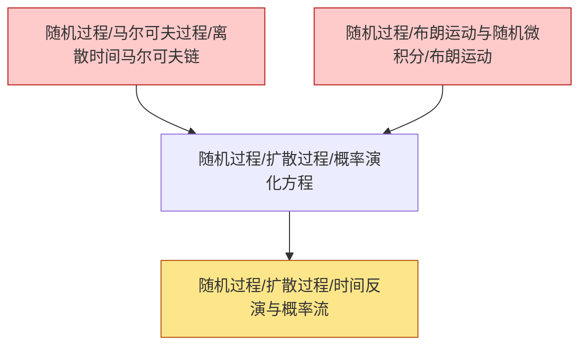

```mermaid
graph TD
1["随机过程/马尔可夫过程/离散时间马尔可夫链"] --> 0["随机过程/扩散过程/概率演化方程"]
2["随机过程/布朗运动与随机微积分/布朗运动"] --> 0["随机过程/扩散过程/概率演化方程"]
0["随机过程/扩散过程/概率演化方程"] --> 3["随机过程/扩散过程/时间反演与概率流"]
classDef leaf fill:#fde68a,stroke:#b45309
class 3 leaf
classDef externalRoot fill:#fecaca,stroke:#b91c1c
class 1,2 externalRoot
click 0 "/随机过程/扩散过程/概率演化方程" "随机过程/扩散过程/概率演化方程"
click 1 "/随机过程/马尔可夫过程/离散时间马尔可夫链" "随机过程/马尔可夫过程/离散时间马尔可夫链"
click 2 "/随机过程/布朗运动与随机微积分/布朗运动" "随机过程/布朗运动与随机微积分/布朗运动"
click 3 "/随机过程/扩散过程/时间反演与概率流" "随机过程/扩散过程/时间反演与概率流"
```