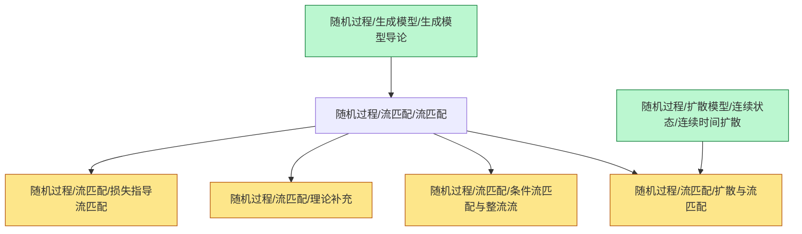

```mermaid
graph TD
1["随机过程/流匹配/流匹配"] --> 0["随机过程/流匹配/损失指导流匹配"]
1["随机过程/流匹配/流匹配"] --> 2["随机过程/流匹配/理论补充"]
1["随机过程/流匹配/流匹配"] --> 3["随机过程/流匹配/条件流匹配与整流流"]
5["随机过程/扩散模型/连续状态/连续时间扩散"] --> 4["随机过程/流匹配/扩散与流匹配"]
1["随机过程/流匹配/流匹配"] --> 4["随机过程/流匹配/扩散与流匹配"]
6["随机过程/生成模型/生成模型导论"] --> 1["随机过程/流匹配/流匹配"]
classDef leaf fill:#fde68a,stroke:#b45309
class 0,2,3,4 leaf
classDef foundationRoot fill:#bbf7d0,stroke:#15803d
class 5,6 foundationRoot
click 0 "/随机过程/流匹配/损失指导流匹配" "随机过程/流匹配/损失指导流匹配"
click 1 "/随机过程/流匹配/流匹配" "随机过程/流匹配/流匹配"
click 2 "/随机过程/流匹配/理论补充" "随机过程/流匹配/理论补充"
click 3 "/随机过程/流匹配/条件流匹配与整流流" "随机过程/流匹配/条件流匹配与整流流"
click 4 "/随机过程/流匹配/扩散与流匹配" "随机过程/流匹配/扩散与流匹配"
click 5 "/随机过程/扩散模型/连续状态/连续时间扩散" "随机过程/扩散模型/连续状态/连续时间扩散"
click 6 "/随机过程/生成模型/生成模型导论" "随机过程/生成模型/生成模型导论"
```