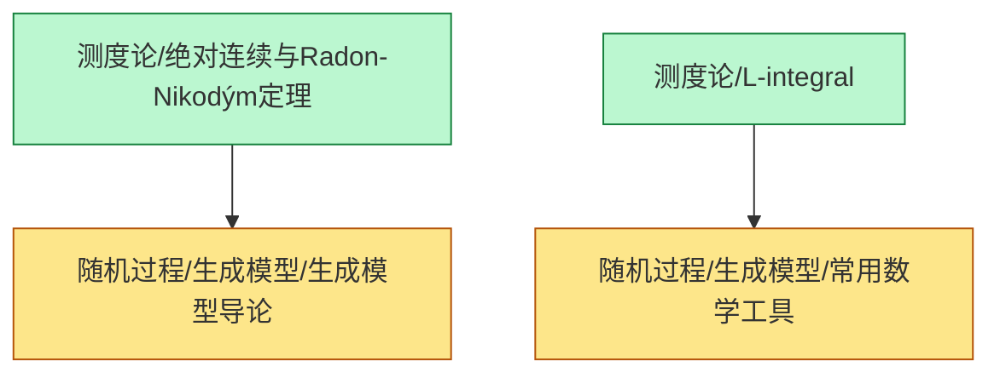

```mermaid
graph TD
1["测度论/绝对连续与Radon-Nikodým定理"] --> 0["随机过程/生成模型/生成模型导论"]
3["测度论/L-integral"] --> 2["随机过程/生成模型/常用数学工具"]
classDef leaf fill:#fde68a,stroke:#b45309
class 0,2 leaf
classDef foundationRoot fill:#bbf7d0,stroke:#15803d
class 1,3 foundationRoot
click 0 "/随机过程/生成模型/生成模型导论" "随机过程/生成模型/生成模型导论"
click 1 "/测度论/绝对连续与radon-nikodým定理" "测度论/绝对连续与Radon-Nikodým定理"
click 2 "/随机过程/生成模型/常用数学工具" "随机过程/生成模型/常用数学工具"
click 3 "/测度论/l-integral" "测度论/L-integral"
```